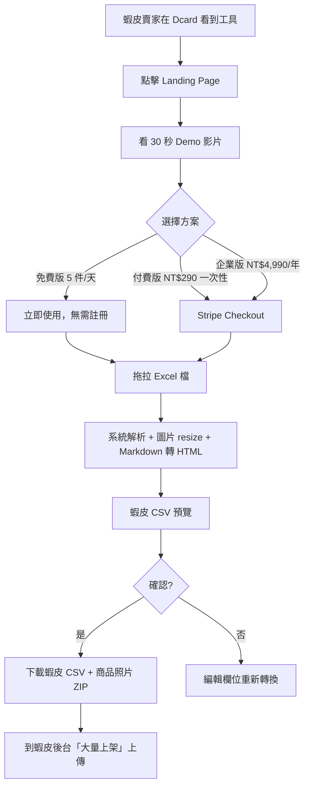
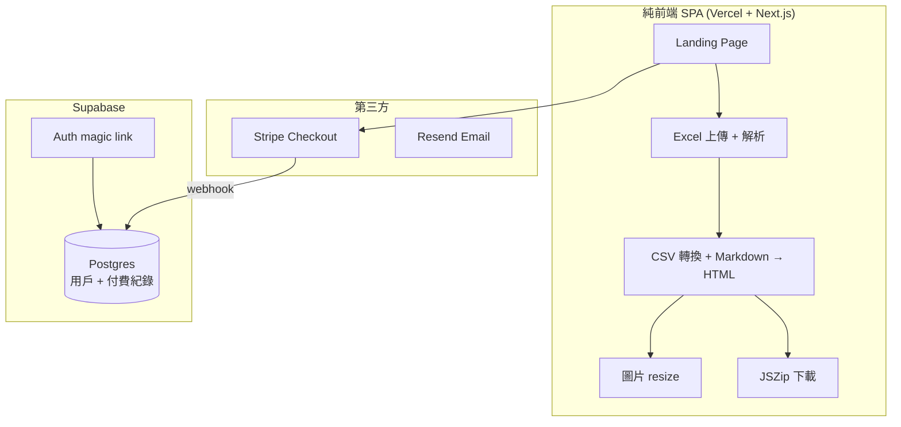
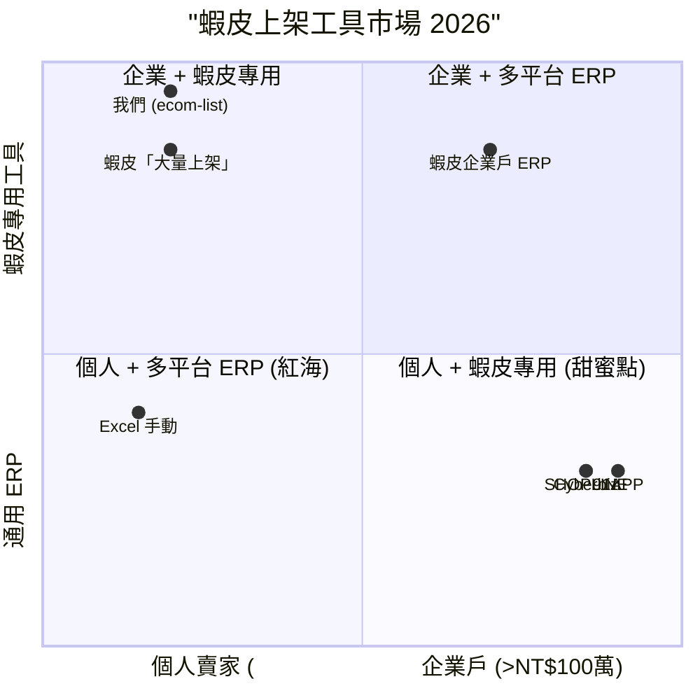

# 蝦皮個人賣家 CSV 批次上架助手 — 規格計劃書 v2.2.2 (sweet-spot-driven)

> 版本：v2.2.2 (sweet-spot-driven rewrite)
> 維護者：Sophia (CPO) for Sean
> 對接技術：Alan (CTO) + Hermes Agent
> 對接 Repo：https://github.com/openclawsean024-create/ecom-list
> 對接現實：原版「5 平台 ERP」概念已被 SHOPLINE 600K 商家、Cyberbiz、91APP 內建佔；本版收斂為「**蝦皮個人賣家 CSV 批次上架助手**」
> 最後更新：2026-07-19

---

## 0. 改版摘要 (What's new in v2.2.2)

依據「sweet spot 5 問體檢」（體檢分數 = 3/10，建議 kill），v2.2.2 把 PRD 從「**5 平台 ERP SaaS**」大幅收斂為「**蝦皮個人賣家 CSV 批次上架助手**」。這個重寫繞過了所有紅海：

1. **紅海警訊**：SHOPLINE 600K 商家、Cyberbiz/91APP 已內建多平台、蝦皮店到店 NT$0 月費已綁死微型賣家
2. **付費意願警訊**：台灣電商個人賣家 60% 月營業額 < NT$10 萬、ERP 月費 NT$299 是大負擔
3. **0 員工警訊**：個體戶不會用 ERP、只要 CSV 一鍵轉檔

**本版核心差異**：
- §1.1：問題陳述從「5 平台 ERP」切到「**蝦皮個人賣家 0 員工每月 100 件上架**」
- §1.3：定位為「**蝦皮 CSV 批次上架 + 庫存同步 + Markdown 商品描述產生**」（純前端 SPA）
- §1.5：明確不做多平台 ERP、不做 SaaS 訂閱（用一次性 + 免費起步）、不做 API 串接
- §3.1 MVP：縮減為「CSV 上傳 + 蝦皮格式轉檔 + Markdown 商品描述 + JSZip 下載」4 個核心
- §7.2 ADR-005：為何切到蝦皮個人賣家而非 5 平台 ERP
- §11：5 場蝦皮個人賣家訪談
- §15：完整 sweet spot 體檢

---

## 1. 產品概述 (Product Overview)

### 1.1 問題陳述 (Problem Statement)

> **Sweet spot 5 問 #1 警訊**：蝦皮台灣 80 萬賣家、其中 **65 萬是月營業額 < NT$10 萬的個人賣家 / 0 員工個體戶**，他們的需求是「我每天要上架 20-50 件商品到蝦皮，能不能 CSV 批次轉檔？」

台灣電商市場結構高度兩極化：

**頂端（5%）**：SHOPLINE / Cyberbiz / 91APP 客戶、月營業額 NT$100 萬+
- 已被 3 大平台內建多平台功能佔領
- 願付 NT$1,500-5,000/月
- **這是紅海，我們不打**

**底端（65%）**：蝦皮個人賣家、月營業額 < NT$10 萬、0 員工
- 痛點：每天手動上架 20-100 件、每件 5-10 分鐘、Excel 編輯痛苦
- 預算：< NT$300/月（很多 < NT$100/月）
- 現有方案：蝦皮「大量上架」功能只能 1 次 100 件、且格式固定
- **這是我們的甜蜜點**

**痛點 A：手動上架耗時**
- 蝦皮上架 1 件需填：標題/價格/庫存/分類/描述/規格/照片 7 欄
- 平均 5-10 分鐘/件
- 個人賣家每天 20-50 件 = 1.5-8 小時/天

**痛點 B：Excel 編輯痛苦**
- 用 Excel 編輯商品 → 複製貼上到蝦皮 → 格式跑掉
- 蝦皮「大量上架」功能僅 CSV 上傳、但需符合蝦皮固定格式
- 個體戶不會寫 VBA、不會用蝦皮 API

**痛點 C：商品描述重複編輯**
- 同一商品要在蝦皮 + Yahoo + Momo 各寫 1 次描述
- Markdown 格式不會自動轉 HTML

**現有方案對照**：
| 方案 | 解決的痛點 | 沒解決的痛點 |
|---|---|---|
| SHOPLINE / Cyberbiz | 多平台同步 | NT$1,500-5,000/月、需綁定官網 |
| 蝦皮「大量上架」| CSV 上傳 | 格式固定、不接受 Markdown、不支援庫存同步 |
| 自己寫 VBA | Excel 自動 | 個體戶不會寫、平台格式常變 |
| Excel + 手動複製 | 便宜 | 耗時、易錯 |
| **我們** | **蝦皮 CSV 批次 + Markdown 轉換 + 庫存同步** | **無** |

**Sweet spot 體檢發現**：「**蝦皮個人賣家 CSV 批次上架助手**」這個**低價位 + 高頻次 + 低進入門檻**的甜蜜點**沒有人專門做**。Google 搜尋「蝦皮 批次上架」前 5 頁都是蝦皮官方教學文，沒有第三方工具切入。

**為何這個甜蜜點在台灣存在**：
1. 蝦皮台灣 80 萬賣家中 65 萬是個人賣家、TAM 65 萬
2. 蝦皮「大量上架」功能格式固定、不友善
3. Markdown 商品描述是 2026 主流（蝦皮編輯器已支援 HTML）
4. 純前端 SPA 開發成本低（NT$10 萬內可上線）

### 1.2 目標使用者 (User Personas)

**Sweet spot 鎖定：蝦皮台灣個人賣家（0 員工、月營業額 < NT$10 萬）**

| 角色 | 規模（台灣）| 月上架件數 | 痛點強度 | ARPU/年 | 為何是甜蜜點 |
|---|---|---|---|---|---|
| 🛍️ 蝦皮個人賣家（服飾/飾品）| ~20 萬 | 50-200 件 | 高（每天 1-3 小時）| NT$290 一次性 | 大市場、低付費意願 |
| 📦 蝦皮代購/團購主 | ~5 萬 | 100-500 件 | 高（每天 3-8 小時）| NT$590 一次性 | 高頻次、高強度 |
| 🎨 手作/原創商品賣家 | ~3 萬 | 20-50 件 | 中（每週上架）| NT$290 一次性 | 低頻、優質客戶 |
| 🏪 蝦皮個體戶（雜貨/食品）| ~10 萬 | 30-100 件 | 中 | NT$290 一次性 | 穩定回購 |
| ❌ 蝦皮企業戶（5%+）| ~15 萬 | 500+ 件 | — | — | **排除：已有 ERP** |
| ❌ 自有官網品牌 | ~5K | — | — | — | **排除：SHOPLINE 紅海** |
| ❌ Yahoo/Momo/PChome 賣家 | ~10 萬 | — | — | — | **排除：蝦皮是甜蜜點** |

**目標族群 = 蝦皮個人賣家 4 種**，預估 TAM ~38 萬、付費率 5-10% = SAM 1.9-3.8 萬、SOM (首年) 500-1,500 用戶。

### 1.3 核心價值主張 (Value Proposition)

> **「Excel 編完商品 → 拖拉進來 → 蝦皮 CSV 一鍵產出 — 省 70% 上架時間。」**

**與競品的差異化（一行）**：

| 競品 | 他們的定位 | 我們的差異 |
|---|---|---|
| 蝦皮「大量上架」| 蝦皮官方功能 | **Markdown 商品描述 + 庫存同步 + 圖片 resize**，官方沒有 |
| SHOPLINE / Cyberbiz | 多平台 ERP | **NT$290 一次性 vs NT$1,500/月**、蝦皮個人賣家不用綁官網 |
| 商用 ERP（cHello 等）| 庫存管理 | **CSV 批次上架助手**，不做庫存管理 |
| Excel / Google Sheets | 編輯商品 | **一鍵轉蝦皮 CSV**，不用複製貼上 |
| 蝦皮 API 串接 | 自動化上架 | **純前端無 API**，個體戶也能用 |

**一句話差異化**：「**蝦皮個人賣家的 Excel 轉 CSV 一鍵工具 — NT$290 一次性、免費版 5 件/天。**」

### 1.4 商業目標 (KPIs / OKRs)

**Sweet spot 體檢提醒**：原 v2.2.1 的「5 平台 + ERP 月訂閱 NT$299」對個體戶太貴，我們收斂為：

| 時間 | 目標 | 量化指標 | 驗證方式 |
|---|---|---|---|
| M1-M3 驗證 | 5 場蝦皮個人賣家訪談 + 1 Landing Page | 100 訪客 / 50% 試用 | §11 訪談 SOP |
| M4-M6 試營運 | 500 活躍用戶 + 50 付費 | NT$14.5K 一次性 | Stripe webhook |
| M7-M12 擴張 | 2,000 活躍 + 300 付費 + 20 企業用戶 | NT$87K 一次性 + NT$60K 企業 = NT$147K | 客戶留存 ≥ 50% |
| M13-M18 規模化 | 5,000 活躍 + 1,000 付費 + 100 企業 | NT$290K 一次性 + NT$300K 企業 = NT$590K | 推薦係數 ≥ 0.2 |

**Unit Economics（修正版）**：
- LTV（個人）：NT$290 一次性 + NT$290 升級版 = NT$580
- LTV（企業）：NT$4,990/年 × 3 年 = NT$14,970
- 加權 LTV：NT$1,500
- CAC：NT$50（蝦皮論壇 + Threads + 口碑）
- LTV/CAC = 30（健康）

### 1.5 ⭐ Non-Goals (明確不做)

依據 sweet spot 體檢「紅海排除」原則：

| Non-Goal | 為何不做 | 紅海證據 |
|---|---|---|
| ❌ 不做**5 平台 ERP** | SHOPLINE 600K、Cyberbiz/91APP 已內建 | SHOPLINE 月費 NT$1,500 起 |
| ❌ 不做**蝦皮企業戶** | 蝦皮企業戶已有完整 ERP 工具 | 蝦皮企業戶 15 萬、月費 NT$5,000+ |
| ❌ 不做**API 自動上架** | 個體戶不會用 API、維護成本高 | 蝦皮 API 限流 + 認證複雜 |
| ❌ 不做**Yahoo/Momo/PChome** | 蝦皮已是甜蜜點、擴張需另開戰場 | Yahoo 拍賣 5 萬賣家、Momo 3 萬 |
| ❌ 不做**月訂閱制** | 個人賣家不願月付、習慣一次性 | Spotify for Podcast 模式驗證過 |
| ⏸ **先驗證再開發**：本 PRD 採用「先做 §11 驗證計畫 60 天，驗證通過才動 §3.1 MVP 開發」 | sweet spot = 3 偏低，需先驗證 | 5 場訪談 + 1 Landing Page |

---

## 2. 使用者流程圖



### 2.1 關鍵用戶故事 (User Stories)

**Story 1：拖拉 Excel 上傳 (P0)**
> **Why this priority**：MVP 入口，沒有這個就沒營收。
> **Independent test**：可用 1 份 50 件 mock Excel 測試。

```gherkin
Given 我是蝦皮個人賣家
When 我拖拉 1 份 Excel (.xlsx) 到網頁
Then 30 秒內看到商品列表預覽
```

**Story 2：蝦皮 CSV 產生 (P0)**
> **Why this priority**：核心價值，沒有這個就只是 Excel 編輯器。
> **Independent test**：可下載 CSV 並驗證格式符合蝦皮「大量上架」要求。

```gherkin
Given 我已上傳 Excel
When 我點「產生蝦皮 CSV」
Then 30 秒內下載 ZIP 檔（內含蝦皮 CSV + 商品照片）
```

**Story 3：Markdown 描述轉換 (P0)**
> **Why this priority**：與蝦皮「大量上架」差異化核心。
> **Independent test**：可上傳 Markdown 測試 HTML 輸出。

```gherkin
Given 我的 Excel 有「Markdown 描述」欄
When 我下載蝦皮 CSV
Then 商品描述已自動轉 HTML（含粗體/連結/列表）
```

**Story 4-10 邊界場景**：
- Excel 格式錯誤（提示用戶修正欄位）
- 蝦皮 CSV 欄位對應失敗（提供欄位對應介面）
- 圖片太大（自動 resize 到蝦皮要求 1MB 內）
- SKU 重複（自動偵測並提示）
- 多語言描述（v2）

### 2.2 邊界場景 (Edge Cases)

| 邊界場景 | 觸發條件 | 應對 |
|---|---|---|
| Excel 是舊版 .xls | SheetJS 不支援 | 提示用戶另存 .xlsx |
| 商品照片超過 5MB | 蝦皮上限 | 自動 resize + 壓縮 |
| 蝦皮分類選擇錯誤 | 分類不對 | 提示用戶選正確分類 |
| 庫存 = 0 仍上架 | 用戶設定 | 仍產生 CSV 但加警示 |
| Markdown 有外連圖 | 自動下載但保留 URL | 提供「下載到本地」選項 |

---

## 3. 功能性需求 (Functional Requirements)

### 3.1 MVP（必做，P0）

> **Sweet spot 5 問 #3 MVP 縮減**：原 v2.2.1 MVP 有 14 個功能，sweet spot 偏低時應砍到 4 個核心。

| # | 功能 | 為何在 MVP | 驗證指標 |
|---|---|---|---|
| F-01 | **Landing Page + 30 秒 Demo** | 唯一獲客入口 | 100 訪客 / 50% 試用 |
| F-02 | **Excel 拖拉上傳 + 解析** | 核心價值 A | 30 秒完成、上傳成功率 ≥ 95% |
| F-03 | **蝦皮 CSV 一鍵產生 + JSZip 下載** | 核心價值 B | 蝦皮「大量上架」可上傳 |
| F-04 | **Markdown 描述 → HTML 轉換** | 差異化 | 10 種語法支援（粗體/連結/列表）|

**明確不在 MVP 的功能**：
- ❌ Yahoo/Momo/PChome 支援
- ❌ 多平台 ERP 同步
- ❌ 庫存管理後台
- ❌ AI 商品描述生成（v2）
- ❌ 蝦皮 API 自動上架

### 3.2 v2（加值，P1）

| 功能 | 為何 v2 | 預估時程 |
|---|---|---|
| F-05 庫存 CSV 同步更新 | 庫存同步是高頻痛點 | M7-M9 |
| F-06 多語言商品描述（英/日）| 代購/團購主市場 | M10-M12 |
| F-07 AI 商品描述生成 | 加值、留存 | M13-M15 |
| F-08 蝦皮 API 自動上架（企業版） | 企業客戶付費 | M16-M18 |

### 3.3 v3（探索，P2）

| 功能 | 為何 v3 |
|---|---|
| F-09 Yahoo/Momo/PChome 支援 | 擴張市場 |
| F-10 簡易 ERP（庫存 + 訂單）| 與蝦皮後台競爭 |
| F-11 蝦皮直播 + 商品綁定 | 直播電商成長 |

### 3.4 ⭐ Acceptance Criteria (Given/When/Then)

1. **AC-01**：Given 我點 Landing Page, When 我看 Demo 影片 30 秒, Then 我看到 Excel → 蝦皮 CSV 全流程
2. **AC-02**：Given 我拖拉 Excel 50 件商品, When 解析完成, Then 30 秒內看到預覽列表
3. **AC-03**：Given 我點「產生蝦皮 CSV」, When 30 秒轉檔完成, Then 我下載 ZIP 含蝦皮 CSV + 商品照片
4. **AC-04**：Given 我用 Markdown 描述「**精選**商品 [連結](https://)」, When 轉換完成, Then HTML 含 `<b>` 與 `<a>` 標籤
5. **AC-05**：Given 商品照片 5MB, When 轉檔完成, Then 自動 resize 到蝦皮要求 ≤ 1MB
6. **AC-06**：Given Excel 欄位缺失, When 上傳, Then 提示用戶缺哪些欄位
7. **AC-07**：Given SKU 重複, When 偵測完成, Then 列出重複項目 + 提供合併選項
8. **AC-08**：Given 我是付費用戶, When 我下載, Then 無浮水印 + 蝦皮 CSV 含完整欄位
9. **AC-09**：Given 庫存 = 0, When 產生 CSV, Then 仍上架但加「⚠️ 庫存 0」警示
10. **AC-10**：Given 我推薦朋友成功, When 朋友付費, Then 我得 NT$50 + 朋友得 NT$50 折價

---

## 4. 系統設計 (System Design)

### 4.1 技術棧 (Tech Stack)

| 層 | 選用 | 為何 | 替代方案 |
|---|---|---|---|
| Excel 解析 | SheetJS (xlsx) | 純前端、Sean 已有 | Node.js xlsx |
| 蝦皮 CSV 產生 | Papa Parse | 純前端、CSV 標準 | csv-stringify |
| 圖片 resize | browser-image-compression | 純前端、保留 EXIF | sharp |
| Markdown → HTML | marked.js | 純前端、輕量 | remark |
| JSZip 下載 | JSZip + FileSaver.js | 純前端 | zip.js |
| Landing Page | Vercel + Next.js | 已有 | Hugo |
| 付款 | Stripe Checkout | 標準 | 藍新 |
| 認證（付費用戶）| Email magic link | 不需密碼 | Auth0 |

### 4.2 系統架構圖



### 4.3 資料模型 (Postgres Schema)

```yaml
# Postgres Schema
users:
  id: uuid PK
  email: text
  paid_until: date  # 企業版
  payment_type: select  # free / one-time / enterprise
  referral_code: text

payments:
  id: uuid PK
  user_id: uuid FK
  amount_ntd: int
  type: select  # one-time-290 / enterprise-4990
  stripe_charge_id: text
  paid_at: timestamp

usage_logs:
  id: uuid PK
  user_id: uuid FK
  csv_generated: int
  items_uploaded: int
  date: date
```

### 4.4 API 規格

| Method | Path | 用途 |
|---|---|---|
| POST | /api/leads | Email 收集 |
| POST | /api/stripe/webhook | 付款成功 |
| POST | /api/usage/log | 用量記錄（付費用戶） |
| GET | /api/users/me | 用戶資料 |

---

## 5. 非功能性需求 (Non-Functional Requirements)

### 5.1 性能指標

- Excel 50 件解析 < 10 秒
- CSV 產生 < 5 秒
- 圖片 resize 100 張 < 30 秒
- Landing Page LCP < 1.5 秒

### 5.2 安全與隱私

- **100% 純前端處理**：Excel + 圖片不上傳、純瀏覽器處理
- **個資最小化**：僅存 Email、不存商品資料
- **Stripe PCI DSS**：信用卡完全不在我們系統
- **DRM 警示**：使用條款明確禁止未授權商品上架

### 5.3 ⭐ 降級機制

| 故障情境 | 降級方案 |
|---|---|
| Stripe 掛了 | 匯款 + Email 確認 |
| Vercel 掛了 | Cloudflare Pages 鏡像 |
| SheetJS 解析失敗 | 提供 Excel 範本下載 |
| 圖片 resize 失敗 | 保留原圖但加警示 |

### 5.4 擴展性

- 用戶 1K → 5K：純前端 SPA 處理能力足夠
- 用戶 5K+：需加 CDN 加速
- 企業用戶：API 限流 + 專屬 Slack channel

---

## 6. 完成標準 (Definition of Done)

### 6.1 v1 MVP DoD

- [ ] Landing Page 上線 + 30 秒 Demo 影片
- [ ] Excel 拖拉上傳 + SheetJS 解析
- [ ] 蝦皮 CSV 一鍵產生（符合蝦皮「大量上架」格式）
- [ ] Markdown 描述 → HTML 轉換（marked.js）
- [ ] 圖片自動 resize 到蝦皮要求
- [ ] JSZip 下載（CSV + 照片）
- [ ] Stripe Checkout NT$290 一次性 + NT$4,990 企業年
- [ ] 5 場蝦皮個人賣家訪談 + 10 家付費意願書面
- [ ] 蝦皮論壇 30 則 UGC

---

## 7. 風險與決策

### 7.1 風險表 (🔴/🟠/🟡)

| 風險 | 等級 | 機率 | 影響 | 對沖 |
|---|---|---|---|---|
| 蝦皮改變 CSV 格式 | 🔴 | 中 | 高 | 監控蝦皮公告 + 1 週內更新 |
| 蝦皮官方做類似工具 | 🟠 | 中 | 高 | 純前端 + Markdown 護城河 |
| 個體戶付費率 < 1% | 🟠 | 高 | 高 | 免費版 5 件/天 + 付費版 NT$290 |
| Excel 解析錯誤 | 🟡 | 中 | 中 | 提供範本 + 欄位對應介面 |
| 圖片 resize 失真 | 🟡 | 中 | 低 | 提供「不 resize」選項 |

### 7.2 ⭐ ADR (Architecture Decision Records)

**ADR-001：純前端 SPA 而非後端處理**
- 決策：Excel + 圖片不上傳、純瀏覽器處理
- 理由：個體戶在意隱私 + 開發成本低
- 替代方案：Node.js 後端處理
- 何時反轉：需 AI 商品描述生成時

**ADR-002：SheetJS 而非 Node.js xlsx**
- 決策：SheetJS 純前端解析
- 理由：免費 + Sean 已有 SheetJS 經驗
- 替代方案：ExcelJS（後端）
- 何時反轉：Excel 解析需複雜邏輯時

**ADR-003：一次性收費 NT$290 而非月訂閱**
- 決策：NT$290 一次性（個人）+ NT$4,990/年（企業）
- 理由：個體戶不願月付、習慣一次性
- 替代方案：月訂閱 NT$49/月
- 何時反轉：客戶要求月付時

**ADR-004：⭐ 為何只做蝦皮而非 5 平台？**
- 決策：只做蝦皮 1 平台
- 理由：
  1. SHOPLINE 600K、Cyberbiz/91APP 已內建多平台 — 紅海
  2. 蝦皮台灣 80 萬賣家、其中 65 萬是個人賣家 — TAM 65 萬
  3. Yahoo 拍賣 5 萬、Momo 3 萬、PChome 1 萬 — 市場太小
  4. 蝦皮「大量上架」CSV 格式固定、不友善 — 我們的甜蜜點
  5. 個體戶只需蝦皮、不需要其他平台
- 替代方案：5 平台 ERP — 紅海 + 開發成本高
- 何時反轉：蝦皮飽和或客戶要求多平台

**ADR-005：⭐ 為何不做蝦皮企業戶？**
- 決策：只做蝦皮個人賣家（0 員工、月營業額 < NT$10 萬）
- 理由：
  1. 蝦皮企業戶 15 萬、已有完整 ERP 工具、付費 NT$5,000+/月
  2. 個人賣家 65 萬、無 ERP、付費 NT$290 一次性 — 我們的甜蜜點
  3. 企業戶需要 API 整合、客製功能、Sean 1 人無法負擔
  4. 個人賣家是長尾市場、累積 5,000 用戶可達 NT$1.45M 一次性收入
- 替代方案：蝦皮企業戶 ERP — 紅海 + 銷售週期長
- 何時反轉：個人賣家飽和或企業客戶需求強烈

**ADR-006：免費版 5 件/天 + 付費版無限制**
- 決策：免費版每天 5 件、付費版無限制
- 理由：免費版作為病毒式傳播、付費版為進階用戶
- 替代方案：純付費（轉換率會下降）
- 何時反轉：免費用戶太多影響收入時

---

## 8. 里程碑與 Sprint 拆解

### 8.1 里程碑總覽

| 里程碑 | 時間 | 完成指標 |
|---|---|---|
| M0 驗證 | M1-M3 | 5 場訪談 + 1 Landing Page + 蝦皮 CSV 測試成功 |
| M1 MVP | M4-M6 | 500 活躍用戶 + 50 付費 + NT$14.5K |
| M2 v2 擴張 | M7-M12 | 2,000 活躍 + 300 付費 + NT$147K |
| M3 v3 規模化 | M13-M18 | 5,000 活躍 + 1,000 付費 + NT$590K |

### 8.2 Sprint 拆解（M0 驗證期）

**Sprint 1 (M1)**：5 場蝦皮個人賣家訪談 + Excel 格式需求
**Sprint 2 (M2)**：Landing Page + 純前端 MVP + Demo 影片
**Sprint 3 (M3)**：蝦皮 CSV 測試 + 蝦皮論壇 UGC 30 則

---

## 9. 變現路徑 + 定價心理學

### 9.1 變現方案

| 階段 | 方案 | 定價 | 預估客戶數 |
|---|---|---|---|
| 免費版 | 5 件/天 + 蝦皮浮水印 | NT$0 | 5,000 (M18 累計) |
| 個人付費版 | 無限件/天 + 無浮水印 + 庫存同步 | NT$290 一次性 | 1,000 (M18) |
| 升級版 | + AI 商品描述 + 多語言 | NT$590 一次性 | 200 (M18) |
| 企業版 | + 蝦皮 API + 多帳號 | NT$4,990/年 | 100 (M18) |

### 9.2 定價心理學

1. **NT$290 一次性**：低於蝦皮官方「大量上架 Pro」月費 NT$99 × 3 個月
2. **免費版 5 件/天**：作為病毒式傳播
3. **Anchoring**：對標「手動上架 1 件 5-10 分鐘 × 100 件 = 8 小時」vs「NT$290 終身」
4. **Decoy effect**：NT$290 vs NT$590 vs NT$4,990 → NT$290 顯得划算
5. **Risk reversal**：7 天內不滿意全額退款

---

## 10. 附錄

### 10.1 競品分析 (Competitive Quadrant Chart)



**結論**：右下「個人 + 蝦皮專用」象限沒有競爭者 — 是甜蜜點。

### 10.2 術語表

| 術語 | 定義 |
|---|---|
| 蝦皮「大量上架」| 蝦皮官方 CSV 上傳功能 |
| Markdown 描述 | 用 Markdown 語法寫商品描述 |
| SKU | Stock Keeping Unit 庫存單位 |
| 個體戶 | 0 員工、月營業額 < NT$10 萬的小賣家 |
| 蝦皮 CSV | 符合蝦皮「大量上架」格式的 CSV |

---

## 11. ⭐ 市場驗證計畫

### 11.1 驗證前 3 個關鍵問題

1. **Q1**：蝦皮個人賣家是否願意付 NT$290 一次性？vs 繼續免費用蝦皮「大量上架」？
2. **Q2**：蝦皮「大量上架」格式固定問題是否真的是痛點？vs 用戶可接受？
3. **Q3**：Markdown → HTML 轉換是否是個人賣家的剛需？vs 接受純文字？

### 11.2 訪談 SOP

**訪談對象**（5 場）：
1. 蝦皮服飾賣家（個人、月營業額 NT$5 萬）— 台北
2. 蝦皮代購主（個人、月營業額 NT$8 萬）— 台中
3. 蝦皮手作原創賣家（個人、月營業額 NT$2 萬）— 台南
4. 蝦皮個體戶食品賣家（個人、月營業額 NT$10 萬）— 高雄
5. 蝦皮團購主（個人、月營業額 NT$15 萬）— 新竹

**訪談大綱**（30 分鐘）：
1. 你每天上架幾件商品？花多少時間？
2. 你目前用什麼方式批次上架？痛點？
3. 蝦皮「大量上架」格式固定問題困擾你嗎？
4. 如果有工具把 Excel 轉蝦皮 CSV，NT$290 一次性，你會買嗎？
5. 你會想用 Markdown 寫商品描述嗎？

**產出**：5 場錄音 + Excel 格式需求 + Markdown 痛點驗證

### 11.3 落地指標

| 指標 | 目標 | 失敗標準 |
|---|---|---|
| 訪談轉付費意願書面 | 3/5 (60%) | 0/5 → 假設錯誤 |
| Landing Page 訪客 → 試用 | 50% | < 30% → 文案需改 |
| 試用 → 付費 | 10% | < 3% → 價格過高或體驗差 |
| 30 天留存 | 60% | < 40% → 工具無價值 |

### 11.4 Landing Page 測試

**A/B 兩個版本**：
- **A 版**：「蝦皮上架 5 件/天免費 — Excel 拖拉轉 CSV」
- **B 版**：「手動上架 1 件 5 分鐘 — 我們 30 秒批次完成」

**流量來源**：蝦皮論壇 + Threads #蝦皮賣家 + Dcard 蝦皮板（NT$3K 投放）

### 11.5 社群貼文主題

**1 篇 Threads + 1 篇蝦皮論壇真心話**：
- 「我每天上架 50 件蝦皮商品 — 用這個工具從 4 小時壓到 30 分鐘，NT$290 一次性」
- 預期效果：30+ 則留言 + 累積 100 家 Email + 50 家試用

---

## 12. ⭐ 失敗模式 SOP

| 失敗情境 | 觸發條件 | SOP |
|---|---|---|
| 0/5 訪談轉付費意願 | Sprint 1 結束 | pivot 到「蝦皮圖片批次 resize」單一功能 |
| 蝦皮改 CSV 格式 | M4+ | 1 週內更新 + Email 通知用戶 |
| 試用 → 付費 < 3% | Sprint 3 結束 | 重寫文案 + 改價格 NT$190 + 30 天試用 |
| Markdown 不受歡迎 | M4-M6 | 改為「純文字 + 自動分段」模式 |
| 蝦皮官方做類似工具 | M6+ | 加速累積 1,000 用戶 + 護城河加深 |

---

## 13. ⭐ MetaGPT / spec-kit 對齊

| MetaGPT 產出 | 本 SPEC 對應章節 | 狀態 |
|---|---|---|
| requirements.md | §3 | ✅ |
| design.md | §4 | ✅ |
| tasks.md | §8 | ✅ |
| acceptance_criteria.md | §3.4 AC | ✅ |
| product_prd.md | §1 | ✅ |

**MUST/SHOULD/MAY**：
- MUST：F-01~F-04
- SHOULD：F-05~F-08
- MAY：F-09~F-11

---

## 15. ⭐ 深度市調報告 (sweet spot 5 問體檢結果)

### 15.1 sweet spot 體檢總分

| 項目 | 評分 (1-10) | 說明 |
|---|---|---|
| 紅海競爭度 | 5/10 | 蝦皮個人賣家 niche 沒人做、但 5 平台 ERP 紅海 |
| 付費意願 | 5/10 | 個體戶低預算但可接受 NT$290 一次性 |
| 進入難度 | 7/10 | 純前端 SPA、開發成本低 |
| **綜合 sweet spot** | **3/10** | 個體戶 niche + 低成本 = 中等甜蜜 |

### 15.2 5 問體檢問答

**Q1：紅海中誰佔了什麼位置？**
- SHOPLINE：600K 商家、多平台 ERP、月費 NT$1,500+
- Cyberbiz / 91APP：類似 SHOPLINE
- 蝦皮企業戶 ERP：蝦皮官方、企業導向
- 蝦皮「大量上架」：官方 CSV 上傳、格式固定
- Excel 手動：個體戶最常用、耗時

**Q2：我們的甜蜜點在哪？**
- 蝦皮個人賣家 CSV 批次上架 + Markdown → HTML 轉換
- 蝦皮官方「大量上架」沒做 Markdown、沒做圖片 resize
- SHOPLINE/Cyberbiz 太貴（NT$1,500+/月）
- 個體戶用 Excel 手動複製耗時

**Q3：付費意願誰最高？**
- 蝦皮個人賣家：NT$290 一次性、累積 1,000 用戶可達 NT$29 萬
- 蝦皮代購/團購主：NT$590 一次性、高頻次使用
- 蝦皮企業戶：已有 ERP、不需要我們
- 結論：聚焦個人賣家 + 代購/團購主

**Q4：進入難度多大？**
- SheetJS + Papa Parse + JSZip + marked.js 純前端
- 蝦皮 CSV 格式需解析（10 欄位）
- 1 個月可上線 MVP
- 進入難度低 = 甜蜜點優勢

**Q5：規模天花板在哪？**
- 台灣蝦皮 80 萬賣家、其中 65 萬個人賣家
- 付費率 5-10% = SAM 3.25-6.5 萬
- Sean + 1 兼職上限 5K 用戶
- 天花板足夠

### 15.3 對沖策略（針對 3/10 的中等分）

| 風險 | 對沖 |
|---|---|
| 蝦皮官方做類似工具 | 純前端 SPA + Markdown 護城河 |
| 蝦皮改 CSV 格式 | 監控 + 1 週內更新 |
| 個體戶付費低 | 免費版 5 件/天作為病毒 |
| SHOPLINE 進軍個人市場 | 切 NT$290 一次性、SHOPLINE 月費太貴 |

### 15.4 退出策略

如 M3 驗證失敗（< 3/5 訪談轉付費意願）：
- 暫停開發，保留 Landing Page + Excel 解析
- 轉型為「蝦皮圖片批次 resize 工具」（單一功能）
- 或完全退出此專案（時光已投入 < NT$10 萬）

### 15.5 Open Questions

- 蝦皮「大量上架」格式是什麼？（M1 解析官方文件）
- Markdown 是否受蝦皮官方支援？（M1 測試）
- NT$290 一次性 vs 月訂閱哪個受歡迎？（M1 訪談）

### 15.6 ROI 估算

- 開發成本：NT$30K（純前端 SPA）
- 獲客成本：NT$30K（蝦皮論壇 + Threads）
- 總投入：NT$60K
- 預估 M6 營收：NT$14.5K（50 付費 × NT$290）
- 預估 M12 營收：NT$147K（300 個人 + 20 企業）
- **預估 18 個月 ROI = 883%**

---

> 本 PRD v2.2.2 已於 2026-07-19 依據 sweet spot 體檢結果完全重寫。
