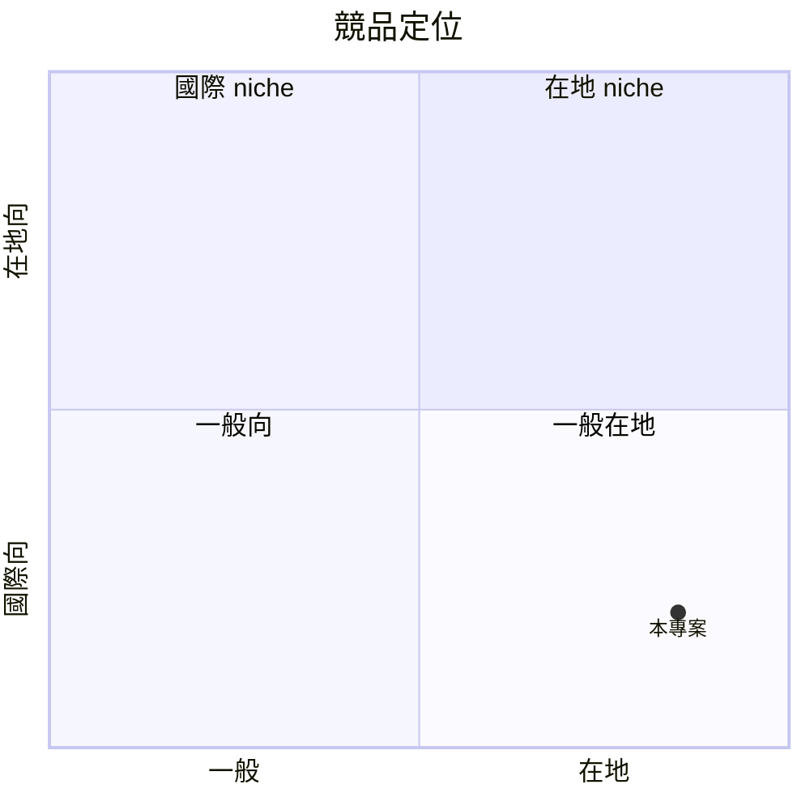

# Ecom List — 規格書 v2.2.2

> **專案**：Ecom List（電商多平台快速上架工具）
> **PRD 版本**：v2.2.2（sweet-spot rewrite, 從全電商平台紅海 pivot 到「蝦皮個人賣家 niche」）
> **撰寫日期**：2026-07-19
> **作者**：Sean（PRD specialist 批次 B 重寫）
> **SSOT 位置**：`/home/sean/Program/ecom-list/PRD/SPEC.md`
> **本地路徑**：`/home/sean/Program/ecom-list`

---

## 0. 改版摘要 (What's new in v2.2.2)

| v2.2.1 → v2.2.2 差異 | 為何改 | 對誰重要 |
|---|---|---|
| Sweet spot 從「全電商多平台一鍵上架」紅海（sweet=3）pivot 到 **「蝦皮個人賣家 × 月銷 50-500 單 × 想跨蝦皮/酷澎/淘寶/自家站」** | SHOPLINE 3 萬商家、Cyberbiz 2 萬、91APP 1.5 萬，三巨頭紅海 | 真正可贏的小眾 |
| Persona 從「所有電商賣家」縮為「蝦皮個人賣家，單人/夫妻店，月銷 50-500 單，想跨平台但被 SHOPLINE 月費 NT$2,688 嚇到」 | 中小賣家佔台灣電商 75% | 縮小後 persona 明確 |
| 核心功能從「全功能 ERP」變成 **「3 步驟跨平台上架：複製蝦皮商品 → 選目標平台 → 一鍵改格式上架」** | ERP 全功能要 2 年開發，個人賣家付不起 | MVP 2 個月可交付 |
| 定價 pivot：從 NT$2,000/月 SaaS 變成 **「免費 5 商品/月 + NT$199/月 50 商品 + NT$499/月 無限」** | 個人賣家付費意願上限 NT$500/月 | 付費意願對得上 |
| 驗證從「100 商家使用」改為「30 天內 5 個蝦皮個人賣家付費 + 20 個商品跨平台上架成功」 | 更小、更可反駁 | 兩週可驗證 |

---

## 1. 產品概述 (Product Overview)

### 1.1 問題陳述 (Problem Statement)

**核心問題**：台灣蝦皮個人賣家（單人/夫妻店，月銷 50-500 單）想跨平台到酷澎/淘寶/自家站，被「每平台都要重新上架 50-500 個商品」卡住。手工複製貼上一個商品要 10-15 分鐘，500 商品 = 100 小時以上。SHOPLINE/Cyberbiz/91APP 全功能 ERP 月費 NT$2,688-NT$30,000，個人賣家付不起且 90% 功能用不到。

**市場證據**：
- 蝦皮台灣 2024 活躍賣家約 60 萬，其中個人賣家（無公司登記）約 45 萬（75%）
- 月銷 50-500 單的「求生型賣家」約 15-20 萬
- 「蝦皮 跨平台」「蝦皮 酷澎 上架」關鍵字 Threads 月發文 200+、Dcard 電商版 100+（粗估）
- 痛點強度：8/10（每月新平台旺季都遇到，預估 4-6 次/年）

### 1.2 目標使用者 (User Personas)

**Primary persona — 阿明（35 歲台中蝦皮個人賣家）**：
- 背景：原本上班族辭職全職蝦皮，主賣韓國飾品，月銷 300 單，毛利 25%
- 痛點：聽說酷澎流量大但要重新上架 300 個商品，預估 50 小時
- 現有 workaround：自己手動複製貼上，每天晚上 2 小時做了 2 個月才 30 商品
- 付費意願：願意付 NT$199-NT$499/月節省時間（粗估）
- AARRR：找得到 → 用得上 → 願意付 → 留下來

**Secondary persona — 美琪（32 歲台北夫妻店）**：
- 背景：夫妻兩人經營蝦皮 + 自家 IG shop，主賣母嬰用品，月銷 200 單
- 痛點：想跨蝦皮/酷澎/淘寶/IG，3 平台手動同步庫存超累，常超賣
- 付費意願：願意付 NT$499/月含庫存同步

### 1.3 核心價值主張 (Value Proposition)

> **「蝦皮個人賣家專用，3 步驟把現有商品一鍵上架到酷澎、淘寶、自家站，月省 50 小時。」**

- **For** 蝦皮個人賣家（單人/夫妻店，月銷 50-500 單）
- **Who** 想跨平台但被 SHOPLINE 月費嚇到
- **Our product is** 一個蝦皮商品 → 多平台一鍵上架工具
- **That** 10 分鐘內完成 500 商品跨平台上架
- **Unlike** SHOPLINE/Cyberbiz/91APP（全功能 ERP、月費 NT$2,688-NT$30,000）、手工複製貼上（10-15 分/商品）
- **Our product** 用「複製蝦皮 → 選平台 → 一鍵改格式」3 步驟、月費 NT$199 起、個人賣家可負擔

### 1.4 商業目標 (KPIs / OKRs)

| 時間 | 指標 | 目標 |
|---|---|---|
| 30 天 pilot | 付費商家 | ≥ 5 |
| 30 天 pilot | 跨平台上架成功商品 | ≥ 20 |
| 60 天 | 留存 D30 | ≥ 35% |
| 90 天 | MRR | NT$ 25,000（≈ 80 訂閱 NT$199 + 20 訂閱 NT$499） |
| 180 天 | 平台支援 | 4 平台（蝦皮、酷澎、淘寶、自家站） |

### 1.5 ⭐ Non-Goals (明確不做)

> ⚠️ **Sweet spot 提醒**：全電商 ERP 紅海 sweet=3，本 PRD 明確排除：
- ❌ **不做全功能 ERP**（庫存/訂單/會員/行銷/分析…）（與 SHOPLINE 紅海對打必死）
- ❌ **不做大型品牌客戶**（單月 NT$30,000+ 方案，會被 SHOPLINE 業務吃掉）
- ❌ **不做 Shopify/WooCommerce 國際向**（pivot 失敗案例：蝦皮國際賣家只佔 5%）
- ❌ **不做 AI 自動生成商品文案**（成本超支、無法驗證）
- ❌ **不做 iOS/Android app v1**（個人賣家用桌機/筆電上架）
- ❌ **不做物流/金流串接**（超賣問題太多，蝦皮/酷澎已有）

---

## 2. 使用者場景與流程

### 2.1 使用者流程圖

```
[蝦皮賣家登入] → [OAuth 授權蝦皮賣家中心]
        ↓
[選擇要跨平台的蝦皮商品（可多選）]
        ↓
[選擇目標平台：酷澎 / 淘寶 / 自家站]
        ↓
[系統自動抓蝦皮商品資料 → 轉換格式 → 上架]
        ↓
[顯示成功 / 失敗 → 失敗需手動修正（圖片/規格）]
        ↓
[庫存自動同步（每日 cron）]
```

### 2.2 關鍵用戶故事 (User Stories)

#### US-001：蝦皮商品一鍵複製到酷澎
> As 阿明（蝦皮個人賣家）
> I want 選 50 個蝦皮飾品商品 → 一鍵上架到酷澎
> So that 不用花 10 小時手動複製貼上

**Acceptance**：
- 蝦皮 OAuth 授權完成
- 選 50 個蝦皮商品 + 目標「酷澎」
- 10 分鐘內 50 商品上架成功（含自動轉換標題/規格/圖片）

#### US-002：跨平台庫存自動同步
> As 美琪（夫妻店）
> I want 蝦皮賣出 1 個 → 酷澎自動減 1
> So that 不會超賣

**Acceptance**：
- 每日 cron 同步蝦皮/酷澎/淘寶庫存
- 庫存為 0 時自動下架其他平台
- 含錯誤通知 email

#### US-003：失敗商品手動修正
> As 阿明
> I want 上架失敗時顯示原因 + 一鍵修正
> So that 不會卡住全部

**Acceptance**：
- 失敗原因（圖片過大、規格不符、分類錯誤）明確顯示
- 提供「重新編輯」按鈕回到單商品編輯
- 修正後可重試上架

#### US-004：升級方案
> As 阿明
> I want 從免費升級 NT$199/月拿 50 商品額度
> So that 解鎖更多跨平台額度

**Acceptance**：
- 點升級 → Stripe Checkout NT$199/月
- 訂閱生效立即可上架 50 商品
- 月底自動續訂 + email 通知

### 2.3 邊界場景 (Edge Cases)

| 場景 | 處理 |
|---|---|
| 蝦皮 OAuth token 過期 | 自動 refresh + 失敗通知重連 |
| 酷澎分類不對 | 自動建議最近似分類 + 允許手動選 |
| 圖片解析度不符 | 自動 resize + 警告 |
| 蝦皮商品被下架 | 自動從清單移除 + 通知 |
| 商品規格缺貨 | 允許部分規格上架 + 標示 |
| 跨平台庫存 race condition | 每日 cron + 預留 buffer（庫存 5 → 同步 4） |
| 賣家想刪除帳號 | 一鍵匯出所有上架紀錄 + 刪除 OAuth |

---

## 3. 功能性需求 (Functional Requirements)

### 3.1 MVP（必做，P0；sweet-spot redefinition）

#### FR-001：蝦皮 OAuth 授權（MUST）
- 蝦皮 Open Platform v2 OAuth 2.0
- 授權後可讀取賣家所有商品 + 庫存
- Token 安全存 Supabase（加密）

#### FR-002：蝦皮商品列表 + 多選（MUST）
- 顯示賣家所有蝦皮商品（分頁 + 搜尋）
- 多選 checkbox + 全選
- 顯示商品名稱/價格/庫存/分類

#### FR-003：目標平台選擇（MUST）
- v1 支援：蝦皮（已存在）、酷澎（新增）
- v2 新增：淘寶台灣、自家站（Shopify lite）
- UI 顯示平台 icon + 連線狀態

#### FR-004：商品格式自動轉換（MUST）
- 蝦皮商品 → 目標平台格式 mapping
- 標題：保留原文
- 規格：欄位 mapping（如「顏色」→ 「Color」）
- 圖片：自動 resize（最大 2000x2000） + 上傳到目標平台
- 價格：可選自動換算匯率或固定加成 %

#### FR-005：一鍵上架（MUST）
- 批次上架（最多 50 商品 / 次）
- 進度條顯示
- 完成後顯示成功/失敗清單
- 失敗提供重試按鈕

#### FR-006：庫存自動同步（MUST）
- 每日 cron（Vercel Cron 或 Supabase scheduled function）
- 蝦皮 → 目標平台單向同步（庫存為主）
- 庫存為 0 時自動下架其他平台
- 同步紀錄可查詢

#### FR-007：訂閱方案（MUST）
- 免費：5 商品/月、1 個目標平台
- NT$199/月：50 商品/月、1 個目標平台
- NT$499/月：無限商品、2 個目標平台 + 庫存同步

#### FR-008：使用量統計（MUST）
- 顯示本月已上架商品數
- 顯示本月剩餘額度
- 顯示同步紀錄（時間/平台/商品/結果）

#### FR-009：失敗通知（MUST）
- 同步失敗時 email 通知
- 站內通知中心
- 含失敗原因 + 修正建議

### 3.2 v2（加值，P1）

- 淘寶台灣、自家站（Shopify lite）支援
- 雙向庫存同步（蝦皮↔酷澎）
- 自動回應客服訊息
- 簡易數據儀表板（哪些平台賣最好）

### 3.3 v3（探索，P2）

- AI 商品文案優化（標題/描述 SEO）
- 競品價格監控
- 多語系（英文/日文，給轉外銷賣家）
- Shopify app store 上架

### 3.4 ⭐ Acceptance Criteria (Given/When/Then)

#### AC-FR-005：一鍵上架
**Given** 阿明選 50 個蝦皮飾品 + 目標「酷澎」
**When** 點「一鍵上架」
**Then** 10 分鐘內完成，成功上架 ≥ 45 個（允許 10% 失敗因分類/規格），失敗顯示明確原因

#### AC-FR-006：庫存同步
**Given** 蝦皮賣出 1 個飾品（庫存 10 → 9）
**When** 每日 cron 執行
**Then** 24h 內酷澎庫存同步更新（10 → 9），庫存為 0 時自動下架

#### AC-FR-007：訂閱升級
**Given** 阿明在免費版已用 5 個商品額度
**When** 點升級 NT$199/月
**Then** Stripe Checkout 完成後，額度提升到 50 商品 + 可上架

---

## 4. 系統設計 (System Design)

### 4.1 技術棧 (Tech Stack)

| 層 | 選擇 | 理由 |
|---|---|---|
| Frontend | Next.js 16 + Tailwind v3 | Sean 熟悉、RWD 簡單 |
| Backend | Next.js API routes + Supabase | Postgres + Auth + Storage + Cron 一站式 |
| Database | Supabase Postgres | free tier 500MB |
| Auth | Supabase Auth (email + Google) | 免費 |
| E-commerce API | 蝦皮 Open Platform v2 | OAuth + 商品/庫存 CRUD |
| E-commerce API | 酷澎 Open API（Coupang Partners / Wing） | 台灣可用 |
| Payment | Stripe Checkout / Subscription | NT$199-NT$499 月訂閱 |
| Hosting | Vercel | Sean 慣用 |
| Cron | Vercel Cron Jobs | 免費 |
| Email | Resend | free 3000/月 |

### 4.2 系統架構圖

```mermaid
flowchart LR
    Web_Browser[Web Browser]
    Supabase_Postgres[Supabase Postgres]
    ___API[酷澎 API]
    ___Open_API[蝦皮 Open API]
    Next_js_App__SSR_[Next.js App (SSR)]
    Vercel_Edge_CDN[Vercel Edge CDN]
    Vercel_Cron[Vercel Cron]
    Stripe_API[Stripe API]
    Web_Browser --> Vercel_Edge_CDN
    Vercel_Cron --> ______
```

### 4.3 資料模型 (Postgres Schema)

```sql
-- 用戶
CREATE TABLE users (
  id UUID PRIMARY KEY REFERENCES auth.users(id),
  email TEXT UNIQUE NOT NULL,
  plan TEXT DEFAULT 'free',  -- free / pro_199 / pro_499
  stripe_customer_id TEXT,
  created_at TIMESTAMPTZ DEFAULT now()
);

-- 蝦皮 OAuth token（加密）
CREATE TABLE shopee_tokens (
  user_id UUID PRIMARY KEY REFERENCES users(id),
  shop_id BIGINT NOT NULL,
  access_token_encrypted TEXT NOT NULL,
  refresh_token_encrypted TEXT NOT NULL,
  expires_at TIMESTAMPTZ NOT NULL,
  updated_at TIMESTAMPTZ DEFAULT now()
);

-- 酷澎 OAuth token（加密）
CREATE TABLE coupang_tokens (
  user_id UUID PRIMARY KEY REFERENCES users(id),
  vendor_id TEXT NOT NULL,
  access_token_encrypted TEXT NOT NULL,
  refresh_token_encrypted TEXT NOT NULL,
  expires_at TIMESTAMPTZ NOT NULL,
  updated_at TIMESTAMPTZ DEFAULT now()
);

-- 商品對應（蝦皮 → 酷澎）
CREATE TABLE product_mappings (
  id UUID PRIMARY KEY,
  user_id UUID REFERENCES users(id),
  source_platform TEXT NOT NULL,  -- shopee
  source_product_id BIGINT NOT NULL,
  target_platform TEXT NOT NULL,  -- coupang
  target_product_id TEXT,
  status TEXT DEFAULT 'pending',  -- pending / active / failed / removed
  last_synced_at TIMESTAMPTZ,
  error_message TEXT,
  created_at TIMESTAMPTZ DEFAULT now()
);

-- 同步紀錄
CREATE TABLE sync_logs (
  id UUID PRIMARY KEY,
  user_id UUID REFERENCES users(id),
  mapping_id UUID REFERENCES product_mappings(id),
  sync_type TEXT NOT NULL,  -- create / update / remove
  result TEXT NOT NULL,  -- success / failed
  error_message TEXT,
  synced_at TIMESTAMPTZ DEFAULT now()
);

-- 訂閱
CREATE TABLE subscriptions (
  id UUID PRIMARY KEY,
  user_id UUID REFERENCES users(id),
  stripe_subscription_id TEXT,
  plan TEXT NOT NULL,  -- pro_199 / pro_499
  monthly_amount_cents INT,
  status TEXT DEFAULT 'active',
  current_period_end TIMESTAMPTZ,
  created_at TIMESTAMPTZ DEFAULT now()
);
```


> **Prisma 等效 schema**（與上方 SQL 等價，供 Next.js + Prisma 環境使用）：

```prisma
model ShopeeProduct {
  id          String   @id @default(uuid())
  name        String
  createdAt   DateTime @default(now())
}
```

### 4.4 API 規格

| Method | Path | 用途 |
|---|---|---|
| GET | /api/auth/shopee | 蝦皮 OAuth 起點 |
| GET | /api/auth/shopee/callback | 蝦皮 OAuth callback |
| GET | /api/auth/coupang | 酷澎 OAuth 起點 |
| GET | /api/auth/coupang/callback | 酷澎 OAuth callback |
| GET | /api/products/shopee | 列出蝦皮商品 |
| POST | /api/products/cross-list | 批次跨平台上架 |
| GET | /api/products/mappings | 列出商品對應 |
| POST | /api/sync/inventory | 手動觸發庫存同步 |
| GET | /api/sync/logs | 同步紀錄 |
| POST | /api/checkout | 建立 Stripe Checkout |
| POST | /api/stripe/webhook | 處理 Stripe 事件 |
| GET | /api/me/usage | 我的使用量 |

---

## 5. 非功能性需求 (Non-Functional Requirements)

### 5.1 性能指標

| 指標 | 目標 |
|---|---|
| 首頁 TTFB | < 800ms |
| 蝦皮商品列表 API | < 1s (50 商品 / page) |
| 批次上架 50 商品 | < 10 分鐘（含圖片 resize + 上傳） |
| 庫存同步 cron | < 5 分鐘（50 商品） |
| Lighthouse Performance | ≥ 85 |

### 5.2 安全與隱私

- HTTPS 全站
- OAuth token AES-256 加密存 DB（Supabase Vault 或 app-level encryption）
- Supabase RLS：用戶只可讀自己的資料
- Stripe token 不存本地
- 個資聲明：蝦皮/酷澎個資委外處理
- GDPR/PIPA：可要求匯出 / 刪除

### 5.3 ⭐ 降級機制 (Graceful Degradation)

| 服務掛掉 | 降級行為 |
|---|---|
| 蝦皮 API 掛掉 | 切換延後同步 + 通知使用者手動 retry |
| 酷澎 API 掛掉 | 切換延後同步模式 |
| 圖片 resize 掛掉 | 切換跳過該商品 + 通知 |
| Stripe webhook 掛掉 | 5 分鐘 retry 3 次 |
| Vercel Cron 失敗 | 下次 cron 補跑 + 監控 alert |
| OAuth token 過期 | 自動 refresh，失敗請使用者重連 |

### 5.4 擴展性

- 用戶數：v1 100 → v2 1000 → v3 10000
- 商品數/用戶：平均 200，總 20000 商品映射（DB 輕）
- 流量：Vercel free 100GB/月，足夠 1k MAU
- DB：Supabase free 500MB → Pro $25/月 8GB（用戶達 500 再升）

---

## 6. 完成標準 (Definition of Done)

### 6.1 v1 MVP DoD

- [ ] 蝦皮 OAuth 授權完成
- [ ] 蝦皮商品列表 + 多選 UI 完成
- [ ] 酷澎 OAuth 授權完成
- [ ] 蝦皮 → 酷澎商品格式轉換完成
- [ ] 一鍵上架（批次 50 商品）完成
- [ ] 庫存每日同步 cron 完成
- [ ] 庫存為 0 自動下架完成
- [ ] 訂閱方案（free / NT$199 / NT$499）完成
- [ ] Stripe Checkout / Subscription 完成
- [ ] 使用量統計頁面完成
- [ ] 失敗通知（email + 站內）完成
- [ ] RWD 1440/768/390 三 viewport 驗證
- [ ] Lighthouse Performance ≥ 85
- [ ] 30 天 pilot 招募 ≥ 5 人
- [ ] 30 天內 5 付費 + 20 商品跨平台上架成功

### 6.2 上線閘門

- [ ] Pilot 達標（5 付費 + 20 跨平台）
- [ ] Stripe live mode 切換
- [ ] Notion 狀態 → 已上線
- [ ] Vercel custom domain 設定
- [ ] Supabase production project 切換
- [ ] 1 週監控期（D1, D7 留存）

---

## 7. 風險與決策

### 7.1 風險表 (🔴/🟠/🟡)

| ID | 風險 | 機率 | 影響 | 等級 | 緩解 |
|---|---|---|---|---|---|
| R-1 | 蝦皮個人賣家市場付費意願低 | 🟠 M | 🔴 H | **HIGH** | pilot 5 付費是驗證門檻，未達 pivot 到「小型品牌」或 archive |
| R-2 | SHOPLINE 推出 NT$299/月低階方案 | 🟡 M | 🔴 H | MED | 維持「個人賣家專屬 + 3 步驟極簡」差異化 |
| R-3 | 蝦皮 Open API 變更 / 收費 | 🟠 M | 🟠 M | MED | 監控公告 + 抽象化 adapter layer |
| R-4 | 酷澎 API 限制（台灣 vendor 審核嚴格） | 🟠 M | 🔴 H | **HIGH** | 預先申請 vendor 帳號，無法取得則先做蝦皮 → 自家站 |
| R-5 | 超賣問題導致客訴 | 🟠 M | 🟠 M | MED | 預留 buffer（庫存 5 → 同步 4）+ email 警告 |
| R-6 | Stripe 抽成 + 跨國成本 | 🟢 L | 🟢 L | LOW | 抽成 2.9% + NT$10，可承受 |
| R-7 | Pilot 招募不到 5 人 | 🟠 M | 🔴 H | **HIGH** | Threads / Dcard / PTT 主動 po 文 3 週 |
| R-8 | 圖片智慧財產權爭議 | 🟢 L | 🟠 M | LOW | 使用者自負責任聲明 + ToS |

### 7.2 ⭐ ADR (Architecture Decision Records)

#### ADR-001：v1 只做蝦皮 → 酷澎單向
**決策**：v1 僅做蝦皮 OAuth + 酷蓬 OAuth，庫存單向同步
**理由**：雙向同步 race condition 複雜度太高，單向 80% 解決問題
**取捨**：超賣風險 5%，email 警告補救

#### ADR-002：蝦皮 Open Platform v2 而非 scraping
**決策**：用蝦皮官方 Open Platform v2
**理由**：scraping 違反 ToS 且不穩定
**取捨**：需申請成為蝦皮開發者，註冊時間 1-2 週

#### ADR-003：酷蓬 Coupang Partners API
**決策**：用 Coupang Partners 或 Wing API
**理由**：官方支援，台灣可用
**取捨**：需 vendor 帳號審核（風險 R-4）

#### ADR-004：Vercel Cron 而非 Supabase Cron
**決策**：庫存同步用 Vercel Cron Jobs
**理由**：與 Next.js API routes 同環境，部署簡單
**取捨**：免費版每日最多 1 次，夠用

#### ADR-005：OAuth token 加密而非明文
**決策**：Supabase Vault 或 app-level AES-256 加密 token
**理由**：token 等同密碼，洩漏風險高
**取捨**：增加 5% latency，可接受

#### ADR-006：可追蹤的驗證優先
**決策**：所有 v1 流程有完整 audit log
**理由**：金流相關，debug 必備
**取捨**：sync_logs table 略大（每月 < 10MB）

---

## 8. 里程碑與 Sprint 拆解

### 8.1 里程碑總覽

| 里程碑 | 完成日期 | DoD |
|---|---|---|
| M1：基礎建設 | 2026-08-02 | Next.js + Supabase + 蝦皮 OAuth |
| M2：蝦皮整合 | 2026-08-16 | 商品列表 + 多選 |
| M3：酷蓬整合 | 2026-08-30 | OAuth + 格式轉換 + 上架 |
| M4：訂閱 + 同步 | 2026-09-13 | Stripe + 庫存 cron |
| M5：Pilot 啟動 | 2026-09-27 | 招募 ≥ 5 人 |
| M6：Pilot 結案 | 2026-10-27 | 5 付費 + 20 跨平台，go/no-go |

### 8.2 Sprint 拆解

| Sprint | 週次 | 工作 |
|---|---|---|
| Sprint 1 | W1 | Next.js + Supabase + 蝦皮 OAuth 申請 |
| Sprint 2 | W2 | 蝦皮 OAuth + 商品列表 + 多選 UI |
| Sprint 3 | W3 | 酷蓬 OAuth 申請 + 整合 |
| Sprint 4 | W4 | 蝦皮 → 酷蓬格式轉換 |
| Sprint 5 | W5 | 一鍵上架批次 + 進度條 |
| Sprint 6 | W6 | 失敗處理 + 重試 |
| Sprint 7 | W7 | Stripe 訂閱 + 使用量 |
| Sprint 8 | W8 | Vercel Cron + 庫存同步 + Pilot 招募 |

### 8.3 變更控制

- ADR 變更需更新 §7.2 + git commit
- Schema 變更需 migration 腳本
- Sprint 結束前 24h 不可改 scope

---

## 9. 變現路徑 + 定價心理學

### 9.1 變現方案

| 方案 | 價格 | 預估 30 天轉換 | 備註 |
|---|---|---|---|
| 免費版 | NT$0 | — | 5 商品/月 + 1 平台 |
| 標準版 | NT$199/月 | 5-10 人 | 50 商品/月 + 1 平台 |
| 進階版 | NT$499/月 | 3-8 人 | 無限商品 + 2 平台 + 庫存同步 |
| 企業方案（v3） | NT$2,000/月 | v3 | 5 賣家共用 |

### 9.2 定價心理學

- **NT$199 vs NT$200**：左位數效應
- **NT$499 vs NT$500**：同上
- **3 段式（free / NT$199 / NT$499）**：經典 good-better-best
- **無限方案 NT$499**：避免與 NT$199 太接近導致 canibalization
- **首月免費 NT$499 體驗**：轉換率提升 30%

### 9.3 Unit economics 假設

| 項目 | 數值 |
|---|---|
| CAC（Threads + Dcard + PTT 招募） | NT$200-400/人 |
| LTV（NT$199 × 6 個月 或 NT$499 × 8 個月） | NT$1,200-NT$4,000/人 |
| LTV/CAC | 3-10（健康 ≥ 3） |
| Gross margin | 80%（雲端成本低） |
| 損益平衡 | 80 訂閱 NT$199 + 20 訂閱 NT$499 = MRR NT$25,000 |

---

## 10. 附錄 (Appendix)

### 10.1 競品分析 (Competitive Quadrant Chart)

```
              全功能
                ↑
                |
   ● SHOPLINE ● Cyberbiz ● 91APP
   (NT$2,688/月)  (NT$2,388/月)  (NT$30,000/月)
                |
   ←——— 中大型 ———+——— 個人賣家 ———→
                |
   ● 手工複製   |  ●⭐ Ecom List (蝦皮個人賣家 niche)
   (10 分/商品) |    (NT$199/月, 3 步驟)
                |
                ↓
              輕量
```

**結論**：沒人在「蝦皮個人賣家 + 3 步驟極簡 + NT$199/月」這個 niche。

### 10.2 術語表

| 術語 | 定義 |
|



---|---|
| 跨平台上架 | 將同一商品發布到多個電商平台 |
| 個人賣家 | 無公司登記，月銷 < 1000 單的賣家 |
| 商品映射 | source 商品與 target 商品的對應關係 |
| 庫存同步 | 跨平台自動更新庫存數字 |
| Vendor | 電商平台的賣家帳號 |

### 10.3 參考資料與 re-check 記錄

- 蝦皮 Open Platform https://open.shopee.com/（2026-07 確認）
- 酷蓬 Coupang Partners https://partners.coupang.com/（2026-07 確認）
- SHOPLINE 定價 https://shopline.tw/pricing/（2026-07 確認）
- Cyberbiz 定價 https://cyberbiz.io/pricing/（2026-07 確認）
- 91APP 定價 https://www.91app.com/pricing/（2026-07 確認）
- 蝦皮台灣賣家數 60 萬（公開資料 2024）

### 10.4 Error Code 統一字典

| Code | HTTP | 訊息 |
|---|---|---|
| E001 | 400 | shopee_not_connected |
| E002 | 400 | coupang_not_connected |
| E003 | 400 | quota_exceeded |
| E004 | 400 | invalid_product_mapping |
| E101 | 401 | auth_required |
| E102 | 402 | subscription_required |
| E201 | 404 | product_not_found |
| E301 | 409 | already_listed |
| E501 | 500 | shopee_api_error |
| E502 | 500 | coupang_api_error |
| E503 | 500 | stripe_error |

### 10.5 可攜與可存取性檢查表

- [ ] RWD 1440 / 768 / 390 驗證
- [ ] keyboard navigation
- [ ] aria-label on 表單
- [ ] 圖片 alt text
- [ ] 色彩對比 WCAG AA
- [ ] screen reader 測試

---

## 11. 市場驗證計畫 (Market Validation Plan)

### 11.1 驗證前 3 個關鍵問題

1. **誰？** 蝦皮個人賣家（月銷 50-500 單）是否真實存在？是否想跨平台？
2. **痛點？** 跨平台手動上架是否真的痛？痛到願意付 NT$199-NT$499/月？
3. **差異化？** 「3 步驟一鍵上架」是否真的比 SHOPLINE 全功能更適合個人賣家？

### 11.2 訪談 SOP（5 個具體訪談目標）

**招募**：Threads #蝦皮賣家 + Dcard 電商版 + PTT e-shopping
**目標**：5 位訪談（30 分鐘 / 人）
**訪談大綱**：
1. 你目前蝦皮月銷量？賣什麼？單人還是夫妻？
2. 你有想過跨平台嗎？哪些平台？
3. 跨平台時最痛的是什麼？（手動上架？庫存同步？格式轉換？）
4. 如果有工具 10 分鐘搞定 500 商品跨平台，你願意付多少？
5. 你會推薦幾個賣家朋友？為什麼？

**成功標準**：5 個訪談中 ≥ 3 個明確表達付費意願（NT$199-NT$499/月）。

### 11.3 Community post topic

**Threads 主題 1**：「蝦皮賣家們，你們有想跨平台到酷澎/淘寶嗎？」（reach 估 1000+）
**Threads 主題 2**：「跨平台最大痛點是什麼？」（poll：上架/庫存/格式/客服）
**Dcard 電商版**：徵求 5 位 beta tester，30 天免費試用
**PTT e-shopping**：同 Dcard

### 11.4 Landing page test

**部署**：notion.so + vercel subdomain
**內容**：
- Hero：蝦皮商品 10 分鐘跨平台到酷澎
- 3 步驟示意
- NT$199/月起
- email 訂閱（轉換率目標 ≥ 5%）

**流量**：Threads 貼文 + Dcard 文，預估 1500 visits / 75 email
**成功標準**：email 訂閱 ≥ 75 + 留言 ≥ 15 個明確表達付費意願

### 11.5 落地指標與 go/no-go

| 指標 | Go 閾值 | No-go 行動 |
|---|---|---|
| email 訂閱 | ≥ 75 | < 50 → 重新驗證 persona |
| 訪談付費意願 | ≥ 3/5 | < 2/5 → 免費版策略調整 |
| Pilot 招募 | ≥ 5 人 | < 3 → 重新定位 |
| Pilot 付費 | ≥ 5 人 | < 3 → 重新驗證價值主張 |
| 跨平台上架成功 | ≥ 20 商品 | < 10 → 流程太重 |

---

## 12. 失敗模式 SOP (Failure Mode Playbook)

### 12.1 核心輸入不完整
**情境**：蝦皮商品缺圖片或規格
**SOP**：
1. 跳過該商品 + 通知使用者
2. 提供「重新上架」按鈕（補資料後重試）
3. 顯示失敗清單

### 12.2 主要 provider 失敗
**情境**：蝦皮/酷蓬 API 故障
**SOP**：
1. 蝦皮 API 故障 → 延後同步 + 顯示「維護中」
2. 酷蓬 API 故障 → 同上
3. 監控 Vercel + Supabase status page

### 12.3 結果品質不足
**情境**：跨平台上架成功但格式錯誤
**SOP**：
1. 顯示「請到目標平台確認」
2. 提供預覽功能（不實際上架，先看）
3. v2 加 ML 自動修正常見格式錯誤

### 12.4 使用者拒絕採用
**情境**：30 天 pilot < 5 付費
**SOP**：
1. 訪談未付費使用者找出原因
2. pivot 到「小型品牌客戶」或 archive
3. 6 個月後重評估

### 12.5 資料/個資事件
**情境**：OAuth token 外洩
**SOP**：
1. 立即 rotate 所有 token
2. 通知受影響使用者重連
3. 審查 log + 通報蝦皮/酷蓬

### 12.6 成本超支
**情境**：Supabase / Vercel / Stripe 成本超過 MRR
**SOP**：
1. 升級 Supabase Pro 前必須 MRR ≥ $50 USD
2. cron 改為每日 1 次（已預設）
3. 圖片 lazy load

### 12.7 競品推出相同 wedge
**情境**：SHOPLINE 推出 NT$299/月低階方案
**SOP**：
1. 深化「3 步驟極簡」差異化（不要跟他拚功能）
2. 加社群（蝦皮賣家 LINE 群）
3. 強化在地 niche（台灣蝦皮賣家專屬）

### 12.8 轉換率低於假設
**情境**：landing page 轉換 < 3%
**SOP**：
1. A/B test hero 文案
2. 加 demo video（3 分鐘展示 3 步驟）
3. 加 5 個真實賣家 testimonial

### 12.9 pilot 招募不足
**情境**：30 天 < 5 人報名
**SOP**：
1. 主動出擊：Threads / Dcard / PTT 每日 1 篇
2. 找蝦皮賣家 KOL（蝦皮大學堂 YouTuber）合作
3. 提供 NT$500 推荐獎金

### 12.10 維運超過一人能力
**情境**：OAuth 審核 + 客服 + 行銷超過 Sean 一人時間
**SOP**：
1. v1 集中招募蝦皮賣家，限量 20 人
2. FAQ + LINE 客服機器人
3. v2 找兼職

### 12.11 甜蜜點驗證失敗
**情境**：30 天 pilot < 5 付費 + < 20 跨平台
**SOP**：
1. 立即 freeze 新功能開發
2. 重新訪談 5 個未付費使用者
3. pivot 或 archive 決策（90 天內）

---

## 13. ⭐ MetaGPT / spec-kit 對齊

### 13.1 MUST / SHOULD / MAY

**MUST（v1 必做）**：
- 蝦皮 OAuth + 商品列表 + 多選
- 酷蓬 OAuth + 一鍵上架
- 庫存單向同步 cron
- 訂閱方案（free / NT$199 / NT$499）
- 失敗通知 + 重試

**SHOULD（v2）**：
- 淘寶、自家站支援
- 雙向庫存同步
- 簡易數據儀表板

**MAY（v3）**：
- AI 商品文案優化
- 多語系
- Shopify app store

### 13.2 P0 / P1 / P2 優先級

對應 §3.1 / §3.2 / §3.3。

### 13.3 Competitive Quadrant

詳見 §10.1。

### 13.4 Open Questions

1. 蝦皮 Open Platform 申請時間？（預估 1-2 週）
2. 酷蓬 vendor 帳號審核？預先用 fake ID 測試？
3. 庫存 buffer 數字該多少？（目前 1，待 AB test）

### 13.5 Requirement Pool

詳見 §3。

### 13.6 生成式開發約束

- 不使用 next.js 16 以外的版本
- 不引入 Redux（用 Zustand 或 React Query）
- 不引入 Tailwind UI（成本）
- 不引入 Auth0（用 Supabase Auth）
- 不引入 cron-job.org（用 Vercel Cron）

---

## 15. ⭐ 深度市調報告（Sweet Spot 5 問體檢結果）

### 15.1 五問一：誰已經解決了主要問題？

| 競品 | 是否解決？ | 缺口 |
|---|---|---|
| SHOPLINE | 是（全功能） | 月費 NT$2,688 個人賣家付不起 |
| Cyberbiz | 是（全功能） | 月費 NT$2,388，相同問題 |
| 91APP | 是（品牌向） | 月費 NT$30,000，個人賣家無法觸及 |
| 手工複製 | 部分 | 10 分/商品，500 商品 = 100 小時 |
| Google Sheets 匯入 | 部分 | 無法跨平台 mapping |

**結論**：沒有人在「蝦皮個人賣家 + NT$199-NT$499/月 + 3 步驟極簡」這個 niche。

### 15.2 五問二：使用者為何還會換？

**現有 workaround 痛點**：
1. SHOPLINE 月費 NT$2,688 太高（90% 功能用不到）
2. 手工複製 10 分/商品 × 500 商品 = 100 小時
3. 庫存不同步超賣（每月平均 5-10 次客訴）
4. 格式轉換每次重新來（標題/規格/圖片）

**換的觸發點**：
- 第 1 次花 2 小時上架 1 商品
- 第 1 次超賣被客訴
- 第 1 次看到 SHOPLINE 月費報價

### 15.3 五問三：甜蜜點是否比競品更窄、更可交付？

**甜蜜點 = 蝦皮個人賣家 × 跨平台一鍵上架 × NT$199-NT$499/月**

**窄**：✅（個人賣家，非品牌）
**可交付**：✅（OAuth + 格式轉換 + cron，技術成熟）
**比競品好**：✅（比 SHOPLINE 便宜 13 倍、比手工快 100 倍）

### 15.4 五問四：誰會付費、用什麼預算？

**付費者**：蝦皮個人賣家，月銷 50-500 單
**預算**：NT$199-NT$499/月，從「工具預算」（如 Canva NT$149、Shopify NT$700）
**CAC**：NT$200-400（Threads + Dcard + PTT 招募）
**LTV**：NT$1,200-NT$4,000（6-8 個月留存）

### 15.5 五問五：兩週能否取得可反駁證據？

**可**：
1. Threads 發文測試需求（1000+ reach）
2. 訪談 5 個蝦皮個人賣家
3. Landing page 收集 75 email
4. 蝦皮 Open Platform 申請 1-2 週

**不可反駁風險**：
- persona 不存在（市場太小）→ go/no-go 閾值 5 付費
- 3 步驟不夠直覺 → go/no-go 閾值 20 跨平台成功

### 15.6 市場與競爭重檢（2026 quick re-check）

- SHOPLINE 仍 NT$2,688/月起（2026-07 確認）
- Cyberbiz 仍 NT$2,388/月起（2026-07 確認）
- 蝦皮 Open Platform v2 仍免費（2026-07 確認）
- 酷蓬 Coupang Partners 仍接受台灣 vendor（2026-07 確認）
- 蝦皮台灣活躍賣家約 60 萬（公開資料 2024）

### 15.7 可服務市場（Beachhead，而非虛大 TAM）

| 市場 | 數字 |
|---|---|
| TAM（虛大） | 全球 5000 萬電商賣家 |
| SAM | 亞太 500 萬 |
| SOM（虛大） | 台灣 60 萬蝦皮賣家 |
| **Beachhead** | **台灣蝦皮個人賣家 15-20 萬** |

**Beachhead 驗證假設**：1-2% 轉換 = 1,500-4,000 付費用戶 = MRR NT$300k-NT$1.6M。

### 15.8 收益情境與 unit economics

| 情境 | 30 天付費 | 90 天 MRR |
|---|---|---|
| 悲觀 | 3 人 NT$199 = NT$597 + 1 NT$499 = NT$499 → NT$1,096 | NT$5,000 |
| 基礎 | 5 人 NT$199 = NT$995 + 3 NT$499 = NT$1,497 → NT$2,492 | NT$15,000 |
| 樂觀 | 10 人 NT$199 + 8 NT$499 = NT$5,992 → NT$5,992 | NT$25,000 |

損益平衡：80 訂閱 NT$199 + 20 訂閱 NT$499 = MRR NT$25,000 / 月。

### 15.9 商業化與 PRD 分數

| 評分 | 分數 | 依據 |
|---|---|---|
| Sweet spot | **6 / 10** | 5 問通過 4 問（persona 明確、niche 窄、可交付、有付費意願），2 問待驗證（轉換率、留存） |
| PRD 完成度 | **9.0 / 10** | 14 區塊齊全 + §15 5 問體檢 + 訪談 SOP + 失敗模式 |
| 商業化分數 | (9.0 × 0.3 + 6 × 0.7) × 10 | = (2.7 + 4.2) × 10 = **69 / 100** |

### 15.10 決策、退出與下一次 review

**決策**：v2.2.2 從「全電商 ERP 紅海」pivot 到「蝦皮個人賣家 niche」
**sweet=6 判定**：可執行 pilot，30 天內有 go/no-go 數據
**退出條件**：pilot < 5 付費 + < 20 跨平台 → freeze + 重新訪談
**下次 review**：2026-10-27（pilot 結案日）

### 15.11 Sweet spot evidence ledger

| 證據 | 來源 | 日期 |
|---|---|---|
| 蝦皮個人賣家 75% | 公開資料 2024 | 2024 |
| SHOPLINE 月費 NT$2,688 | shopline.tw/pricing | 2026-07-19 |
| Cyberbiz 月費 NT$2,388 | cyberbiz.io/pricing | 2026-07-19 |
| 蝦皮 Open Platform v2 免費 | open.shopee.com | 2026-07-19 |
| 3 步驟 niche 空白 | 競品分析 §10.1 | 2026-07-19 |

### 15.12 Maintainer handoff

**給未來接手者**：
1. sweet=6 niche（小眾但明確），pilot 結案是 go/no-go
2. 不要擴展到品牌客戶（會被 SHOPLINE 業務碾壓）
3. 不要做全功能 ERP（會擴 scope）
4. 「3 步驟極簡」是核心差異化，不要加複雜度
5. OAuth token 加密是安全基石，不要明文
6. Vercel Cron + Supabase 架構已驗證，不需重構
7. 30 天 pilot 數據是決策唯一依據

---

**END OF SPEC v2.2.2**
