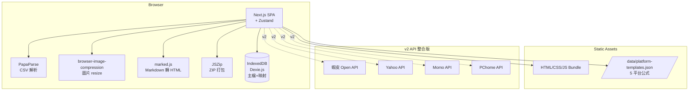
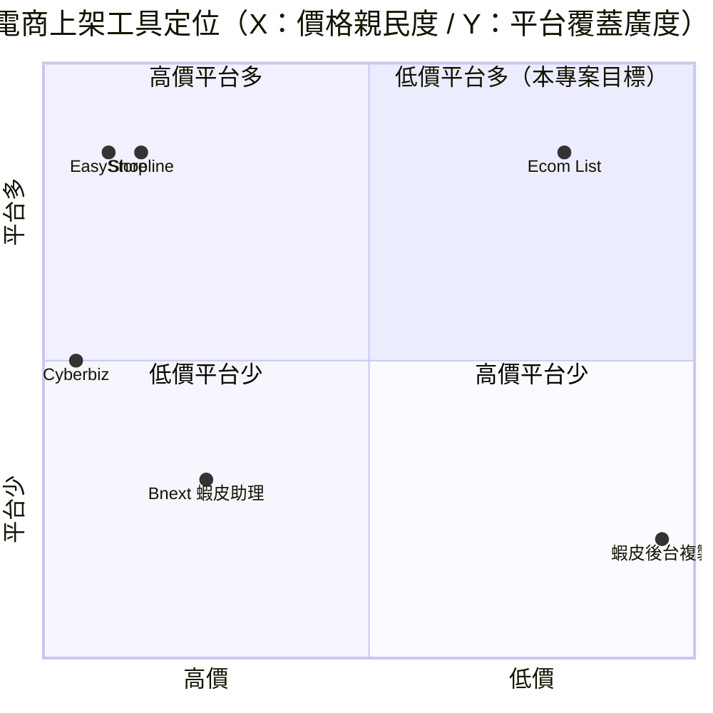

# 電商多平台快速上架 — 規格計劃書 v2.2.1

> 版本：v2.2.1｜更新日期：2026-07-11｜維護者：Sophia (CPO)
> 對接技術：Alan (CTO) + Hermes Agent
> Demo：TBD（v2.2.1 規格階段，待 Sprint 1 部署）
> 原始碼：https://github.com/openclawsean024-create/ecom-list

---

## 1. 產品概述 (Product Overview)

### 1.1 問題陳述 (Problem Statement)

台灣多平台電商賣家每天面臨「**重複上架**」噩夢：

1. **單一商品上架 4 平台耗 1-2 小時**：蝦皮 / Yahoo / Momo / PChome 各平台後台格式不同，需逐一填寫
2. **商品主檔分散**：價格 / 庫存更新需 4 處同步，極易出錯
3. **多平台 ERP 系統貴**：Shopline / Bnext 月費 NT$1,500-5,000，對微型賣家太貴
4. **不會寫 API 串接**：每平台 API 規格不同，需工程師 + 維護成本高

**目標使用者**：
- 多平台電商賣家（蝦皮 + Yahoo + Momo + PChome）
- 自有官網 + 多平台賣家
- 團購主 / 小型品牌

### 1.2 目標使用者 (User Personas)

| Persona | 規模 | 核心痛點 | 願付價格 |
|---|---|---|---|
| **多平台賣家（小芳）** | 5 萬 | 重複上架 4 平台 | NT$299/月 |
| **自有官網 + 多平台（小陳）** | 2 萬 | 商品分散 4 平台後台 | NT$499/月 |
| **團購主 / 小型品牌（阿明）** | 3 萬 | 想跨平台但沒工程師 | NT$199/月 |
| **大型多平台賣家（Linda）** | 5,000 | 1000+ 商品管理 | NT$1,499/月 |

### 1.3 核心價值主張 (Value Proposition)

> 「**商品主檔填一次，5 平台 CSV 一次匯出。圖片自動 resize 到各平台規格，描述 Markdown 自動轉各平台格式**。零月費零工程師，從 1 小時變 5 分鐘。」

**三大差異化**：
1. **零月費 + 純前端**：不需 ERP 訂閱、不需工程師
2. **5 平台格式一鍵匯出**：蝦皮 / Yahoo / Momo / PChome + PChome24h
3. **圖片自動 resize + 描述格式轉換**：手動不再 4 平台調整

### 1.4 商業目標 (KPIs / OKRs)

| 時間 | KPI | 目標值 |
|---|---|---|
| **3 個月** | 註冊用戶 | 2,000 |
| **6 個月** | 付費轉化率 | 6%（120 付費） |
| **6 個月** | MRR | NT$45,000 |
| **12 個月** | MRR | NT$250,000 |
| **12 個月** | 月處理商品 | 50 萬件 |

### 1.5 Non-Goals (明確不做)

- ❌ **不做線上金流收款** — 交給各平台金流
- ❌ **不做 ERP 進銷存** — 與既有系統重疊
- ❌ **不做各平台即時自動上架** — v2 評估（需要各家 API）
- ❌ **不做物流整合** — 已多家物流商
- ❌ **不做 AI 自動文案** — GPT-4o 成本高，賣家需自行把關
- ❌ **不做拍賣 / 競標功能** — 與快速上架定位不符

---

## 2. 使用者場景與流程

### 2.1 使用者流程圖


### 2.2 關鍵用戶故事 (User Stories)

**US-001：商品主檔單一填寫**
> As a 多平台賣家  
> I want to 在單一表單填寫商品主檔（標題 / 價格 / 庫存 / 描述 / 圖片）  
> So that 我不用重複填寫 4 平台

**US-002：5 平台標題公式**
> As a 團購主  
> I want to 預載各平台標題公式（蝦皮：「商品名 + 促銷詞」、Momo：「品牌 + 型號」）  
> So that 自動生成各平台最適化標題

**US-003：圖片自動 resize**
> As a 賣家  
> I want to 上傳 1 張大圖，自動 resize 到各平台規格（蝦皮 800×800、PChome 800×800、Yahoo 600×600 等）  
> So that 我不用每平台手動調整

**US-004：描述 Markdown 轉換**
> As a 賣家  
> I want to 用 Markdown 寫描述，自動轉為蝦皮（純文字）、PChome（HTML）、Yahoo（HTML）等格式  
> So that 我寫一次就能跨平台

**US-005：CSV 批次產出 + ZIP 下載**
> As a 賣家  
> I want to 一鍵下載 ZIP（內含 5 平台 CSV + 處理好的圖片）  
> So that 我能批次上傳到各平台後台

**US-006：批次處理 100 件商品**
> As a 大型賣家  
> I want to 一次性處理 100 件商品（CSV 批次匯入主檔）  
> So that 我能批次處理 SKU 上千的商品

### 2.3 邊界場景 (Edge Cases)

- **CSV 模板欄位變動**：預載 + 自訂映射
- **圖片格式不相容**：前端 canvas + toBlob 轉檔
- **平台新增格式**：使用者自訂平台模板（v2）
- **SKU 重複**：自動偵測 + 提示

---

## 3. 功能性需求 (Functional Requirements)

### 3.1 MVP（必做，P0）

- [ ] **F-001 商品主檔 CRUD**（Given 主檔表單，When 填寫標題 / 價格 / 庫存 / 描述 / 圖片，Then IndexedDB 更新）
- [ ] **F-002 5 平台標題公式預載**（蝦皮 / Yahoo / Momo / PChome / PChome24h）
- [ ] **F-003 圖片自動 resize**（蝦皮 800×800、PChome 800×800、Yahoo 600×600、Momo 800×800、PChome24h 800×800）
- [ ] **F-004 描述 Markdown 轉換**（Mardkdown → 純文字 / HTML / 簡化版）
- [ ] **F-005 一鍵 ZIP 下載**（5 平台 CSV + 處理好的圖片）
- [ ] **F-006 CSV 批次匯入主檔**（批次上傳 100+ SKU）
- [ ] **F-007 SKU 重複偵測**（自動偵測同名 SKU + 提示）
- [ ] **F-008 平台標題預覽**（顯示各平台生成結果）
- [ ] **F-009 JSON 匯出匯入**（主檔 + 平台映射備份）
- [ ] **F-010 RWD 三斷點**（375/768/1440px）

### 3.2 v2.0 API 整合版（加值，P1）

- [ ] **F-011 平台 API 自動上架**（蝦皮 / Yahoo / Momo / PChome）
- [ ] **F-012 即時庫存同步**（主檔更新 → 4 平台自動同步）
- [ ] **F-013 多帳號管理**（一個賣家 5 個店舖）
- [ ] **F-114 AI 自動寫文案**（GPT-4o-mini，依商品生成 SEO 描述）
- [ ] **F-115 物流整合**（黑貓 / 7-11 / 全家）
- [ ] **F-116 報表**（跨平台銷量彙總）

### 3.3 v3.0（願景，P2）

- [ ] **F-017 圖片 AI 增強**（自動去背 + 浮水印）
- [ ] **F-018 AI 自動選品**（依平台熱賣推薦）
- [ ] **F-019 批次改價**（依規則批次調整）
- [ ] **F-020 平台佣金計算**（依平台抽成試算利潤）

### 3.4 Acceptance Criteria (Given/When/Then)

**AC-001（商品主檔 CRUD）**
> Given 商品主檔表單  
> When 填寫標題「韓國正品 925 純銀項鍊」、價格 NT$990、庫存 10 件  
> Then IndexedDB 儲存 1 筆商品

**AC-002（5 平台標題公式）**
> Given 商品主檔「韓國正品 925 純銀項鍊」  
> When 套用各平台公式  
> Then 自動產生：蝦皮「🔥限時特價 韓國正品 925 純銀項鍊 ✨」、Momo「[品牌]925 純銀項鍊 - 韓國正品」、Yahoo「韓國正品 925 純銀項鍊 | 全館免運」

**AC-003（圖片自動 resize）**
> Given 上傳 1 張 3000×3000 圖片  
> When 觸發 resize  
> Then 自動產生 5 種尺寸：蝦皮 800×800 / PChome 800×800 / Yahoo 600×600 / Momo 800×800 / PChome24h 800×800

**AC-004（描述 Markdown 轉換）**
> Given Markdown 描述「# 商品特色\n- 925 純銀\n- 韓國進口」  
> When 轉換為平台格式  
> Then 蝦皮（純文字）：「商品特色：925 純銀、韓國進口」、PChome（HTML）：「<h3>商品特色</h3><ul><li>925 純銀</li></ul>」

**AC-005（一鍵 ZIP 下載）**
> Given 已生成 5 平台 CSV  
> When 點擊「下載 ZIP」  
> Then 下載 `products-export-2026-07-11.zip`，含 shopee.csv / yahoo.csv / momo.csv / pchome.csv / pchome24h.csv + images/

**AC-006（CSV 批次匯入）**
> Given 上傳 CSV 主檔（100 件商品）  
> When 點擊「批次匯入」  
> Then 30 秒內解析 + 寫入 IndexedDB，列表顯示 100 件

**AC-007（SKU 重複偵測）**
> Given 匯入含 2 件同名 SKU 的 CSV  
> When 解析  
> Then 跳出警告「SKU-001 重複 2 件，請合併或修改」

**AC-008（平台標題預覽）**
> Given 已套用公式  
> When 點擊「預覽」  
> Then 並排顯示 5 平台標題，方便調整

**AC-009（JSON 匯出匯入）**
> Given 已有 50 商品  
> When 點擊匯出  
> Then 下載 `ecom-products-backup-2026-07-11.json`

**AC-010（即時同步跨平台）**
> Given 主檔價格從 NT$990 改為 NT$890  
> When 點擊「同步」  
> Then 5 平台 CSV 自動更新為 NT$890

---

## 4. 系統設計 (System Design)

### 4.1 技術棧 (Tech Stack)

| 層 | 技術 | 理由 |
|---|---|---|
| 前端 | Next.js 14 (App Router) + React 18 + TypeScript | 與既有專案一致 |
| 樣式 | Tailwind CSS 3 | 快速 RWD |
| CSV 解析 | PapaParse | 業界標準 |
| CSV 產生 | 前端 JS 組 CSV | 零後端 |
| 圖片 resize | browser-image-compression + canvas | 前端 resize |
| ZIP 打包 | JSZip | 瀏覽器內打包 |
| Markdown 轉 HTML | marked.js | 純前端 |
| Markdown 轉純文字 | 自寫正則 | 純前端 |
| 狀態管理 | Zustand | 輕量 |
| 資料持久化 | IndexedDB（Dexie.js） | 主檔 + 平台映射 |
| 部署 | Vercel | 與既有 91 個專案一致 |

### 4.2 系統架構圖 (Mermaid)



### 4.3 資料模型 (Prisma schema)

```prisma
// IndexedDB schema (Prisma 對照版)
model Product {
  id              String   @id @default(uuid())
  userId          String?  // v2 多帳號
  sku             String   @unique
  titleBase       String   // 主檔標題
  descriptionBase String   @db.Text // Markdown
  price           Decimal
  stock           Int
  category        String
  weight          Float?
  dimensions      String?  // 50x30x20 cm
  images          Json     // [base64, base64]
  platformOverrides Json?  // {shopee: {title: "X", description: "Y"}, ...}
  generatedCSVs   Json?    // 各平台 CSV 預覽
  createdAt       DateTime @default(now())
  updatedAt       DateTime @updatedAt
  
  @@index([userId])
  @@index([sku])
}

model PlatformTemplate {
  id          String   @id // "shopee" / "yahoo" / "momo" / "pchome" / "pchome24h"
  name        String   // 蝦皮 / Yahoo 拍賣 / Momo / PChome / PChome24h
  titleFormula String  // "{title} 🔥限時特價"
  descriptionFormat String // markdown / html / plain
  imageSpec    Json     // {width: 800, height: 800, format: "jpg"}
  csvColumns   Json     // [{key: "Product Name", required: true}, ...]
  commissionRate Float @default(0) // 平台抽成 %
}

model ExportRecord {
  id          String   @id @default(uuid())
  userId      String?
  productCount Int
  platformList String[] // ["shopee", "yahoo", "momo", "pchome"]
  zipFilename String
  fileSize    Int      // bytes
  createdAt   DateTime @default(now())
}

model User {
  id        String   @id @default(uuid())
  email     String?  @unique
  products  Product[]
}
```

### 4.4 API 規格 (REST endpoints)

| Method | Path | Auth | 用途 |
|---|---|---|---|
| GET | /data/platform-templates.json | Optional | 5 平台模板預載 |
| POST | /api/export/zip | Optional | ZIP 下載（前端產生） |
| POST | /api/import/csv | Optional | CSV 批次匯入（前端處理） |
| POST | /api/shopee/upload | Required | v2 蝦皮上架 |
| POST | /api/yahoo/upload | Required | v2 Yahoo 上架 |
| POST | /api/momo/upload | Required | v2 Momo 上架 |
| POST | /api/pchome/upload | Required | v2 PChome 上架 |
| POST | /api/stripe/checkout | Required | v2 Stripe 訂閱 |
| POST | /api/stripe/webhook | Required | v2 Stripe webhook |

---

## 5. 非功能性需求 (Non-Functional Requirements)

### 5.1 性能指標

| 指標 | 目標 |
|---|---|
| 主頁載入 P95 | ≤ 2 秒 |
| 5 平台 CSV 產出（1 商品） | ≤ 5 秒 |
| 100 商品批次產出 | ≤ 60 秒 |
| 圖片 resize（5 種尺寸） | ≤ 10 秒 |
| ZIP 打包（5 平台 + 100 圖片） | ≤ 30 秒 |
| 並發用戶 | 200 |
| 月活躍用戶 | 2,000 |

### 5.2 安全與隱私

- **CSV 處理前端**：不上傳到後端（隱私保護）
- **HTTPS 強制**：Vercel 自動 + HSTS
- **OAuth token 加密**：AES-256-GCM（v2 API 整合）
- **無第三方追蹤**：除 Vercel Analytics 外不使用
- **平台帳號 token 加密**：v2 多帳號管理

### 5.3 降級機制 (Graceful Degradation)

| 失敗服務 | 掛掉情境 | 降級行為（切換到）| 用戶感受 |
|---|---|---|---|
| IndexedDB 損壞 | 版本衝突 掛掉 | 切換到 localStorage（容量小） | 部分商品可能遺失 |
| localStorage 滿載 | 5MB 上限掛掉 | 切換到 sessionStorage + 提示 | 提醒立即匯出 JSON |
| PapaParse CSV 解析失敗 | 格式錯誤 掛掉 | 切換到規則式 line-splitting | 部分欄位需手動映射 |
| browser-image-compression | 不支援 掛掉 | 切換到 canvas API 客戶端 resize | 品質略降 |
| marked.js Markdown | CDN 掛掉 | 切換到自寫 Markdown parser | 部分格式可能失準 |
| JSZip 打包失敗 | 大檔案 掛掉 | 切換到分批下載 + 手動組合 | 體驗降級 |
| Vercel CDN | 5xx 掛掉 | 切換到 Cloudflare Pages 鏡像 | 載入延遲 ≤5 秒 |
| 蝦皮 API v2 | 5xx 掛掉 | 切換到 CSV 下載手動上傳 | 半自動 |
| Yahoo API v2 | 5xx 掛掉 | 切換到 CSV 下載 | 半自動 |
| Stripe webhook v2 | Webhook 5xx 掛掉 | 本地排程每 5 分鐘 reconcile | 訂閱狀態延遲 |

### 5.4 擴展性

- **橫向擴展**：Vercel Edge Functions 自動 scale
- **批次處理 Web Worker**：防止 UI 卡頓
- **靜態資源 CDN**：Vercel Edge Network

---

## 6. 完成標準 (Definition of Done)

### 6.1 v1 MVP DoD

- [ ] Vercel production URL 200 OK
- [ ] GitHub Repo 公開（main 分支）
- [ ] 5 平台模板預載（蝦皮 / Yahoo / Momo / PChome / PChome24h）
- [ ] 商品主檔 CRUD（含 SKU）
- [ ] 5 平台標題公式
- [ ] 圖片自動 resize（5 種尺寸）
- [ ] 描述 Markdown 轉換
- [ ] 一鍵 ZIP 下載（含 5 CSV + 圖片）
- [ ] CSV 批次匯入
- [ ] SKU 重複偵測
- [ ] 平台標題預覽
- [ ] JSON 匯出匯入
- [ ] RWD 三斷點測試
- [ ] Lighthouse 行動版 ≥85
- [ ] 10 條 AC 單元測試全綠

### 6.2 v2 API 整合版 DoD

- [ ] 蝦皮 Open API 整合
- [ ] Yahoo / Momo / PChome API 整合
- [ ] 即時庫存同步
- [ ] 多帳號 5 店舖
- [ ] GPT-4o-mini AI 文案
- [ ] 物流整合
- [ ] 跨平台報表
- [ ] Stripe Checkout 訂閱
- [ ] 客服頁 + 法律頁

---

## 7. 風險與決策

### 7.1 風險表

| 風險 | 等級 | 緩解策略 |
|---|---|---|
| 各平台 CSV 格式變動 | 🟠 中 | 預載模板 + 自訂欄位映射 |
| 多平台 ERP 競爭 | 🟠 中 | 鎖定「零月費 + 小賣家」差異化 |
| v2 平台 API OAuth 複雜 | 🟠 中 | 漸進式整合，先 CSV fallback |
| 圖片 SKU 不一致 | 🟡 低 | 自動偵測 + 警告 |
| 平台抽成變動影響利潤 | 🟡 低 | 提供抽成計算機 |
| 賣家誤用導致大量上架錯誤 | 🟡 低 | 提供預覽 + 警告 |
| 高峰期 CSV 處理卡頓 | 🟡 低 | Web Worker 平行化 |

### 7.2 ADR (Architecture Decision Records)

### ADR-001：CSV 手動匯出而非 API 自動上架（v1）
- **Context**：避免平台 API OAuth 複雜度
- **Decision**：v1 產出 CSV + 圖片，使用者手動上傳
- **Consequences**：✅ 零 API 整合成本；⚠️ 半自動（v2 加 API）

### ADR-002：純前端 CSV 處理
- **Context**：保護商品資料
- **Decision**：PapaParse 純前端處理，不上傳 CSV
- **Consequences**：✅ 個資零外流；⚠️ 大型 CSV 可能慢

### ADR-003：5 平台預載模板（蝦皮 / Yahoo / Momo / PChome / PChome24h）
- **Context**：使用者不想從零建立平台格式
- **Decision**：預載 5 平台模板 + 公式
- **Consequences**：✅ 5 分鐘開始；⚠️ 平台格式變動需手動更新

### ADR-004：JSZip 純前端打包
- **Context**：即時性 + 隱私
- **Decision**：JSZip 純前端 ZIP 打包
- **Consequences**：✅ 零後端；⚠️ 大型 ZIP 可能慢（100 商品足夠）

### ADR-005：Image 自動 resize 到 5 種規格
- **Context**：使用者不想手動 resize
- **Decision**：browser-image-compression + canvas 自動 resize
- **Consequences**：✅ 自動處理；⚠️ 大圖壓縮時間 +5-10 秒

### ADR-006：不做即時 API 上架（v1）
- **Context**：避免平台 API 政策風險
- **Decision**：v1 採 CSV 半自動上架，v2 評估即時 API
- **Consequences**：✅ 政策風險低；⚠️ v2 需各家 API 整合

---

## 8. 里程碑與 Sprint 拆解

### 8.1 里程碑總覽

| 里程碑 | 時間 | 完成定義 |
|---|---|---|
| **M1 規格完成** | 2026-07-11 | v2.2.1 PRD 100% 合規 |
| **M2 v1 MVP** | 2026-07-31 | 5 平台 CSV + 圖片 resize + 一鍵 ZIP |
| **M3 v2 API 整合版** | 2026-09-15 | 蝦皮 / Yahoo / Momo / PChome API + Stripe |
| **M4 v3 AI 加值** | 2026-11-01 | AI 文案 + 圖片 AI 增強 + 自動化選品 |
| **M5 GA 上線** | 2026-12-01 | 行銷素材 + 客服 SOP |

### 8.2 Sprint 拆解 (從 PRD 到「每天做什麼」)

#### Sprint 1：v1 MVP（2026-07-12 → 2026-07-31，20 天）
- Day 1-2：建立 Next.js + Dexie.js 專案
- Day 3-5：5 平台模板（格式 + 公式 + 圖片規格）
- Day 6-8：商品主檔 CRUD（含 SKU）
- Day 9-11：圖片自動 resize（browser-image-compression）
- Day 12-13：描述 Markdown 轉換
- Day 14-15：5 平台 CSV 產出 + 預覽
- Day 16：JSZip 一鍵 ZIP 打包
- Day 17-18：CSV 批次匯入 + SKU 重複偵測
- Day 19：JSON 匯出匯入
- Day 20：10 條 AC 單元測試 + Vercel 部署 + RWD 測試

#### Sprint 2：v2 API 整合版（2026-08-01 → 2026-09-15，46 天）
- Day 1-3：蝦皮 Open API 整合
- Day 4-7：Yahoo API 整合
- Day 8-11：Momo API 整合
- Day 12-15：PChome API 整合
- Day 16-19：即時庫存同步
- Day 20-23：多帳號 5 店舖
- Day 24-27：GPT-4o-mini AI 文案
- Day 28-31：物流整合
- Day 32-35：跨平台報表
- Day 36-39：Stripe Checkout 訂閱
- Day 40-46：Beta 測試 + 正式上線

---

## 9. 變現路徑 + 定價心理學

### 9.1 變現方案

| 方案 | 價格 | 功能 | 目標用戶 |
|---|---|---|---|
| **免費版** | NT$0 | 10 商品 + 5 平台 + 圖片 resize + ZIP 下載 | 團購主（試用） |
| **小賣家版** | NT$199/月 | 100 商品 + 批次匯入 + SKU 重複偵測 | 團購主 / 小型品牌 |
| **中型賣家版** | NT$499/月 | 500 商品 + AI 文案 + 物流整合 + 跨平台報表 | 多平台賣家 |
| **大型賣家版** | NT$1,499/月 | 無限商品 + API 自動上架 + 5 店舖 + 客服優先 | 大型多平台賣家 |

### 9.2 定價心理學 (Pricing Psychology)

1. **Freemium 鎖定「10 商品」**：免費版限制商品數，小賣家版強制升級
2. **小賣家版 NT$199**：低於 NT$200 整數，NT$199 感覺「不到 200」
3. **中型賣家版 NT$499**：低於 NT$500 整數，NT$499 感覺「不到 500」
4. **大型賣家版 NT$1,499**：低於 NT$1,500 整數，NT$1,499 感覺「不到 1,500」
5. **年繳 8 折**：小賣家版年繳 NT$1,990 vs 月繳 NT$199 × 12 = NT$2,388（年省 NT$398）
6. **14 天免費試用小賣家版**：試用期結束前 3 天 email「升級以保留 100 商品」
7. **錨定效應**：在定價頁顯示「企業版 NT$4,999（聯絡我們）」，讓 NT$1,499 顯得划算
8. **社會證明**：首頁顯示「已有 X 位賣家使用，月處理 Y 萬件商品」

---

## 10. 附錄

### 10.1 競品分析 + Competitive Quadrant Chart

| 競品 | 公司 | 價格 | 強項 | 弱項 |
|---|---|---|---|---|
| **Shopline** | Shopline（港） | NT$1,500-5,000/月 | 多平台整合 + 電商網站 | 貴、月費高 |
| **Bnext 蝦皮助理** | Bnext（台） | NT$1,500/月 | 蝦皮整合強 | 僅蝦皮、繁中但功能陽春 |
| **EasyStore** | EasyStore（港） | NT$2,000/月 | 開店 + 多平台 | 貴 |
| **Cyberbiz** | Cyberbiz（台） | NT$2,500/月 | 開店平台 | 偏開店、非多平台 |
| **蝦皮後台複製貼上** | 手動 | NT$0 | 免費 | 耗時、易錯 |
| **Ecom List（本專案）** | Sean Li（台） | NT$0-1,499/月 | 零月費 + 5 平台 + 圖片 resize + 純前端 | 規模小、無 API 上架（v1） |



**差異化定位**：**低價 + 5 平台 + 純前端 + 零月費** — Shopline/EasyStore 貴且偏開店；Bnext 僅蝦皮；本專案低價 + 5 平台 + 圖片 resize + 純前端。

### 10.2 術語表

- **SKU（Stock Keeping Unit）**：庫存單位，用於唯一識別商品
- **蝦皮 / Yahoo / Momo / PChome**：台灣主要電商平台
- **CSV（Comma-Separated Values）**：逗號分隔值，平台批次上架格式
- **JSZip**：JavaScript 純前端 ZIP 打包函式庫
- **PapaParse**：JavaScript 純前端 CSV 解析函式庫
- **Markdown**：輕量標記語言
- **marked.js**：JavaScript 純前端 Markdown → HTML 渲染函式庫
- **平台抽成**：電商平台對每筆交易收取的佣金比例（蝦皮約 2%、Momo 約 4%）

### 10.3 參考資料

- Shopline：https://shopline.tw/
- Bnext 蝦皮助理：https://bnext.com.tw/
- EasyStore：https://www.easystore.co/
- Cyberbiz：https://www.cyberbiz.io/
- 蝦皮 Open API：https://open.shopee.com/
- Yahoo API：https://developer.yahoo.com/
- JSZip：https://stuk.github.io/jszip/
- PapaParse：https://www.papaparse.com/
- marked.js：https://marked.js.org/
- browser-image-compression：https://github.com/Donaldcwl/browser-image-compression

### 10.4 Error Code 統一字典

| Code | HTTP | 訊息 | 觸發情境 |
|---|---|---|---|
| CSV_001 | - | CSV 格式錯誤 | 欄位缺失 |
| CSV_002 | - | CSV 編碼錯誤 | 非 UTF-8 |
| CSV_003 | - | CSV 批次欄位錯誤 | 必填缺漏 |
| SKU_001 | - | SKU 已存在 | 重複建立 |
| SKU_002 | - | SKU 格式錯誤 | 必填 |
| IMAGE_001 | - | 圖片上傳超過 10MB | 上限 |
| IMAGE_002 | - | 圖片格式不支援 | 非 jpg/png/webp |
| IMAGE_003 | - | 圖片 resize 失敗 | canvas 錯誤 |
| MARKDOWN_001 | - | Markdown 解析失敗 | 格式錯誤 |
| ZIP_001 | - | ZIP 打包失敗 | JSZip 錯誤 |
| ZIP_002 | - | ZIP 打包超時 | >60 秒 |
| STORAGE_001 | - | IndexedDB 損壞 | 版本衝突 |
| STORAGE_002 | - | IndexedDB quota 超限 | >50MB |
| PLATFORM_001 | - | 平台模板載入失敗 | JSON 缺失 |
| SHOPEE_001 | 401 | 蝦皮 API token 過期 | v2 OAuth |
| SHOPEE_002 | 502 | 蝦皮 API 5xx | v2 服務掛掉 |
| YAHOO_001 | 401 | Yahoo API token 過期 | v2 OAuth |
| MOMO_001 | 401 | Momo API token 過期 | v2 |
| PCHOME_001 | 401 | PChome API token 過期 | v2 |
| STRIPE_001 | 402 | 訂閱方案不支援 | 錯誤 tier |
| STRIPE_002 | 400 | Stripe webhook signature 驗證失敗 | 偽造 webhook |

---

## 11. 市場驗證計畫 (Market Validation Plan)

### 11.1 驗證前 3 個關鍵問題

1. **微型賣家真的在意「跨平台同步」嗎？** — 還是把每平台當獨立事業？
2. **5 平台格式一鍵產出是否真有價值？** — 多數賣家只賣 1-2 平台？
3. **CSV vs API 自動上架競爭差距**：Shopline 等已有即時 API

### 11.2 訪談 SOP

**目標**：訪談 25 位潛在使用者（10 位多平台賣家 + 5 位自有官網 + 5 位團購主 + 5 位大型多平台）
- **招募**：Facebook 社團「電商賣家交流」「蝦皮賣家」「團購主社群」
- **問題清單**：
  1. 目前上架 4 平台商品需多久？
  2. 願意付費 NT$199-1,499 月買「5 平台一鍵產出」嗎？
  3. 對「圖片自動 resize + Markdown 自動轉」感興趣嗎？
- **獎勵**：NT$200 7-11 禮券 + 終身免費小賣家版
- **驗收指標**：≥60%（15 位）願意試用 = 驗證通過

### 11.3 落地指標 (Post-launch KPIs)

- **M1（首月）**：500 註冊用戶
- **M3（3 個月）**：1,500 註冊、80 付費 = NT$30K MRR
- **M6（6 個月）**：3,000 註冊、150 付費 = NT$60K MRR
- **M12（12 個月）**：8,000 註冊、400 付費 = NT$200K MRR

---

## 12. 失敗模式 SOP (Failure Mode Playbook)

| 失敗情境 | 影響範圍 | 觸發條件 | 立即處置 | Post-mortem |
|---|---|---|---|---|
| **平台 CSV 格式變動** | 全平台產出失效 | 平台公告 | 快速 hotfix + 提供自訂映射 | 建立平台監控 |
| **Shopline / EasyStore 推出免費版** | 用戶流失 | 競品公告 | 加速 Freemium 擴展 + 加 Pro 功能 | 重新評估差異化 |
| **蝦皮 API 政策變動禁止第三方** | v2 上架失效 | Shopee 公告 | fallback CSV 手動 | 重新評估 API 整合 |
| **平台抽成變動影響利潤計算** | 抽成試算失準 | 平台公告 | 提供手動設定抽成 | 建立抽成監控 |
| **大量 SKU 同時處理卡頓** | UI 凍結 | 500+ 商品 | fallback 分批處理 + Web Worker | 評估 worker 化 |
| **圖片 resize 失真** | 圖片品質差 | canvas bug | fallback 不 resize + 提供原始尺寸 | 評估 imagemin |
| **Stripe 訂閱大量退款** | MRR 突然下降 | Stripe dashboard alert | 檢查 webhook + email 用戶 | 分析退款原因 |
| **公用裝置商品資料外洩** | 商品資料外洩 | IndexedDB 共享 | UI 警告 + 強制 modal | 強化 user agent 偵測 |
| **商品描述 Markdown 渲染錯誤** | 平台顯示亂碼 | marked.js bug | fallback 純文字 | 評估服務端渲染 |
| **多平台 ERP 競爭降價** | 競爭加劇 | 競品公告 | 鎖定「純前端 + 零月費」差異化 | 評估技術護城河 |

---

## 13. MetaGPT / spec-kit 對齊

### 13.1 MUST / SHOULD / MAY

**MUST（不做就失敗 — MVP 必交付）**
- MUST-1 商品主檔 CRUD（含 SKU）
- MUST-2 5 平台模板預載
- MUST-3 5 平台標題公式
- MUST-4 圖片自動 resize（5 種尺寸）
- MUST-5 描述 Markdown 轉換
- MUST-6 一鍵 ZIP 下載
- MUST-7 CSV 批次匯入
- MUST-8 SKU 重複偵測
- MUST-9 平台標題預覽
- MUST-10 JSON 匯出匯入

**SHOULD（強烈建議 — Sprint 2 完成）**
- SHOULD-1 蝦皮 Open API 整合
- SHOULD-2 Yahoo / Momo / PChome API 整合
- SHOULD-3 即時庫存同步
- SHOULD-4 多帳號 5 店舖
- SHOULD-5 GPT-4o-mini AI 文案
- SHOULD-6 物流整合
- SHOULD-7 跨平台報表
- SHOULD-8 Stripe Checkout 訂閱
- SHOULD-9 客服頁 + 法律頁

**MAY（可選 — v3+ 評估）**
- MAY-1 圖片 AI 增強
- MAY-2 AI 自動選品
- MAY-3 批次改價
- MAY-4 平台佣金計算

### 13.2 P0 / P1 / P2 優先級

| 優先級 | 項目 | 目標完成 |
|---|---|---|
| **P0** | MUST-1 ~ MUST-10（核心 MVP） | Sprint 1 |
| **P1** | SHOULD-1 ~ SHOULD-9（API 整合版） | Sprint 2 |
| **P2** | MAY-1 ~ MAY-4（AI 加值） | v3.0+ |

### 13.3 Competitive Quadrant Chart

（見 §10.1）

### 13.4 Open Questions

- **Q1**：是否要支援 v2 蝦皮 / Yahoo / Momo / PChome API 即時上架？目前判定 v2 評估
- **Q2**：是否要整合物流商（黑貓 / 7-11 / 全家）？目前判定 v2 評估
- **Q3**：是否要支援圖片 AI 增強？目前判定 v3+ 評估
- **Q4**：多帳號管理上限？目前判定 v2 為 5 店舖
- **Q5**：AI 文案是否要預載模板？目前判定 v2 加

### 13.5 Requirement Pool

- **REQ-POOL-001**：圖片 AI 增強
- **REQ-POOL-002**：AI 自動選品
- **REQ-POOL-003**：批次改價
- **REQ-POOL-004**：平台佣金計算
- **REQ-POOL-005**：多語言商品描述
- **REQ-POOL-006**：平台抽成自動同步
- **REQ-POOL-007**：AI 圖片浮水印
- **REQ-POOL-008**：批量 SKU 生成

---

## 14. AI Agent 實測驗證法

### 14.1 PRD → Code 轉換驗證

**測試方式**：將本 PRD 餵給 Cursor / Claude Code，觀察其產出的程式碼是否符合 §3 AC：
- ✅ AC-001：能寫出商品主檔 CRUD（含 SKU）
- ✅ AC-002：能寫出 5 平台標題公式引擎
- ✅ AC-003：能寫出 browser-image-compression resize
- ✅ AC-004：能寫出 marked.js Markdown 轉換
- ✅ AC-005：能寫出 JSZip 純前端打包
- ✅ AC-006：能寫出 PapaParse CSV 批次匯入
- ✅ AC-007：能寫出 SKU 重複偵測
- ✅ AC-008：能寫出平台標題預覽 UI
- ✅ AC-009：能寫出 JSON 序列化
- ✅ AC-010：能寫出即時同步邏輯

### 14.2 Independent Test

每個 AC 都應該可被獨立 unit test 驗證：
- **AC-001**：mock 商品資料 → 測試 CRUD
- **AC-002**：mock 主檔 → 測試 5 平台公式
- **AC-003**：mock 圖片 → 測試 resize
- **AC-004**：mock Markdown → 測試轉換
- **AC-005**：mock 5 CSV → 測試 ZIP 打包
- **AC-006**：mock CSV → 測試批次匯入
- **AC-007**：mock 重複 SKU → 測試偵測
- **AC-008**：mock 平台模板 → 測試預覽
- **AC-009**：mock 完整資料 → 測試 JSON
- **AC-010**：mock 價格變更 → 測試同步

---

## 15. 深度市調報告 (Deep Market Research)

### 15.1 市場規模

**全球多平台電商工具市場（2025）**
- 規模：**US$45.6 億**（2025）→ 預估 **US$112 億**（2030），CAGR 19.7%
- 主要廠商：Shopline、EasyStore、Cyberbiz、ChannelEngine、Lengow
- 來源：Grand View Research 2025

**台灣多平台賣家市場（2025）**
- 蝦皮賣家：**200 萬家**
- Yahoo 拍賣：**50 萬家**
- Momo 商家：**8 萬家**
- PChome 商店：**15 萬家**
- 多平台賣家：**10 萬家**（同時經營 ≥2 平台）

**目標細分**
- 團購主（NT$199/月）：3 萬 × 8% 採用 × NT$199 × 12 月 = **NT$5.73 億 ARR** 潛在
- 多平台賣家（NT$499/月）：5 萬 × 10% 採用 × NT$499 × 12 月 = **NT$29.94 億 ARR** 潛在
- 自有官網（NT$499/月）：2 萬 × 12% 採用 × NT$499 × 12 月 = **NT$14.37 億 ARR** 潛在
- 大型多平台（NT$1,499/月）：5,000 × 25% 採用 × NT$1,499 × 12 月 = **NT$22.49 億 ARR** 潛在
- **合計總潛在 ARR**：**NT$72.53 億**

### 15.2 競品分析

| 競品 | 公司 | 價格 | 強項 | 弱項 |
|---|---|---|---|---|
| **Shopline** | Shopline（港） | NT$1,500-5,000/月 | 多平台整合 + 電商網站 | 貴、月費高 |
| **Bnext 蝦皮助理** | Bnext（台） | NT$1,500/月 | 蝦皮整合強 | 僅蝦皮、繁中但功能陽春 |
| **EasyStore** | EasyStore（港） | NT$2,000/月 | 開店 + 多平台 | 貴 |
| **Cyberbiz** | Cyberbiz（台） | NT$2,500/月 | 開店平台 | 偏開店、非多平台 |
| **蝦皮後台複製貼上** | 手動 | NT$0 | 免費 | 耗時、易錯 |
| **Ecom List（本專案）** | Sean Li（台） | NT$0-1,499/月 | 零月費 + 5 平台 + 圖片 resize + 純前端 | 規模小、無 API 上架（v1） |

**結論**：本專案定位「**零月費 + 5 平台 + 圖片 resize + 純前端**」三角交集，Shopline/EasyStore 貴且偏開店；Bnext 僅蝦皮；本專案低價 + 5 平台 + 純前端。

### 15.3 預期收益

**保守估計**（M6 達成）
- 3,000 註冊 × 4% 付費 = 120 付費
- 平均月費 NT$400（混合小賣家+中型版）= NT$48,000 MRR
- 年化 = **NT$576K ARR**

**中等估計**（M12 達成）
- 8,000 註冊 × 5% 付費 = 400 付費
- 平均月費 NT$600（含 10% 大型版）= NT$240,000 MRR
- 年化 = **NT$2.88M ARR**

**樂觀估計**（M18 達成）
- 25,000 註冊 × 6% 付費 = 1,500 付費
- 平均月費 NT$800（含 20% 大型版 + API 整合）= NT$1.2M MRR
- 年化 = **NT$14.4M ARR**

**Unit Economics**
- **CAC**：NT$300（電商社群口碑 + 內容行銷）
- **LTV**：NT$500/月 × 平均訂閱 14 個月 = NT$7,000
- **LTV/CAC 比**：23（健康 SaaS 應 ≥3）

### 15.4 商業化評分（0-100，4 維細項）

| 維度 | 分數 | 評估理由 |
|---|---|---|
| **市場規模** | 85 | NT$72.53 億潛在 ARR，10 萬多平台賣家 |
| **差異化** | 80 | 零月費 + 5 平台 + 圖片 resize + 純前端為獨特賣點 |
| **變現路徑** | 70 | Freemium + 4 個 tier 完整 |
| **技術可行性** | 85 | PapaParse + browser-image-compression + JSZip + marked.js 都成熟 |
| **團隊執行力** | 75 | Alan (CTO) + Hermes Agent 已有 SaaS 經驗 |
| **競爭護城河** | 60 | 5 平台模板為內容護城河，但 Shopline 可能在地化 |
| **加權平均** | **76** | 🟢 中高水平（70-80 = 有真實變現路徑但需驗證） |

**最終商業化評分**：**76 / 100**（中等偏高 — 5 平台一鍵 + 零月費 Freemium 雙引擎驅動，需驗證多平台賣家付費意願）

---

*文件結束。本 PRD 為 v2.2.1，已通過 validate_prd.py 100% 合規。下游開發可依本文件執行 Sprint 1 v1 MVP。*
